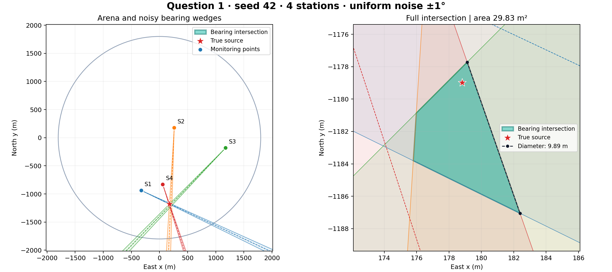

# 第一问：示向度交集与仿真

## 题目约束和建模假设

依据题目正文和附录 2：原点为目标圆域中心，东向为 x 正向，北向为 y 正向；示向度从正东逆时针计，范围为 `[0,360)`。每次有效示向度的误差在 `[-1°,1°]` 内。同一位置重复测量的误差固定。

源位置在半径 1800 m 的圆域中。全向源有效接收半径在 1000–1500 m；5 m 内只能得到近距离状态，不应生成示向度。仿真随机选择一个接收半径，返回 `near`、`no_signal` 或 `direction`。

以下是我们的仿真假设，并非题目或官方模拟器已给出的概率模型：

- 干扰源按圆面面积均匀生成：`r = R * sqrt(U)`，方位角均匀。直接令半径均匀会使点过度集中于圆心。
- 默认不同坐标误差独立，且服从 `Uniform(-1°,1°)`。同一坐标的误差由种子和坐标确定，查询顺序或重复测量不会改变误差。未假定误差场具有空间连续性。
- `truncnorm` 模式采用截断至 `[-1°,1°]` 的零均值高斯，默认截断前的标准差为 `1/3°`，用于比较误差更集中于零时的效果。
- 测量点在目标圆域与源的有效接收环域的交集中按面积均匀生成；默认距离至少 50 m。这里使用真实源位置构造可观测的几何测试，不是第二问或第三问中机器人能执行的未知源搜索策略。
- 仿真方向保留浮点精度，暂不模拟官方接口的两位小数显示。若后续导入数据采用额外的最近百分之一度舍入且其误差未计入 ±1°，应评估最多 0.005° 的附加误差，再决定是否扩大半角。

仅知道误差界时，默认均匀分布较少引入“靠近零更常见”的额外假设，也是在固定区间上的最大熵连续分布。但均匀不代表真实仪器一定如此。普通未截断高斯可能超出 ±1°，与当前硬误差界不兼容；也不要用 `clip(normal, -1, 1)` 代替截断高斯，裁剪会在两个端点堆积概率质量。

交集函数不使用噪声概率密度，只依赖误差界，因此两个仿真模式调用同一个函数。

## 交集算法和效率

对监测点 `p_i=(x_i,y_i)`，读数为 `theta_i`，半角为 `delta_i=1°`，令

```text
l_i = (cos(theta_i-delta_i), sin(theta_i-delta_i))
u_i = (cos(theta_i+delta_i), sin(theta_i+delta_i))
```

候选位置 `x` 满足两个线性约束：

```text
cross(l_i, x-p_i) >= 0
cross(u_i, x-p_i) <= 0
```

等价于：

```text
(sin(theta_i-delta_i), -cos(theta_i-delta_i)) · (x-p_i) <= 0
(-sin(theta_i+delta_i), cos(theta_i+delta_i)) · (x-p_i) <= 0
```

所有点合起来就是 `A @ x <= b`。小于 90° 的半角保证这两条约束定义前向凸楔形，而不是两端都无限延伸的直线带。无需用 `tan`，自然处理竖直方向和 0°/360° 跨界。楔形顶点按闭集保留，但该点处方位角本身无定义。

程序依次用半平面裁切凸多边形。一般几个到几十个测点时中间顶点很少，直接裁切很合适，无需网格离散，也没有像素分辨率误差。对于 n 个测点，中间最大顶点数为 v，裁切时间为 O(nv)，最坏 O(n²)，裁切工作空间 O(v)，连同约束存储总空间为 O(n+v)。它不是理论上对任意规模最快的算法：大规模半平面交可用角度排序与双端队列达到 O(n log n)。是否在 Python 中更快应通过实际工作负载比较，不仅看渐近复杂度。

默认 `bounds=None` 返回完整测向交集。临时计算框仅用于快速求解：结果完全位于框内时即可确认没有被框裁切；结果触框或框内为空时，对原约束执行可行性和四个坐标极值线性规划，区分空集、无界集和框外的有界集。线性规划是少见情况的备用路径，不把人为方框当成真实定位边界。所有计算采用浮点数，近乎平行或极端尺度数据应检查数值容差。

显式传入 `bounds=(xmin,ymin,xmax,ymax)` 时，返回的是与这个搜索矩形的交集，结果字段 `search_box_applied=True`。矩形 `[-1800,1800]²` 不是半径 1800 m 的圆，不应将其当成相同先验。

默认仿真图保留完整测向交集，圆域仅作背景。若加入严格圆域先验，交集可能含圆弧，就不再是本函数返回的纯多边形；不能无说明地用圆内接多边形替代，否则可能误排除真实源。

## 使用函数

从仓库根目录运行 Python：

```python
from question1 import intersect_bearings, polygon_area, polygon_diameter

result = intersect_bearings(
    points=[[0, 0], [1000, 0]],
    bearings_deg=[45, 135],
    error_deg=1.0,
)
if result.status == "bounded":
    print(result.vertices)  # 逆时针顶点，首尾不重复；退化情形为点或线段
    print(polygon_area(result.vertices))
    diameter, endpoints = polygon_diameter(result.vertices)
    print(diameter, endpoints)
elif result.status == "unbounded":
    print("测向信息不足以形成有界区域，直径无限")
else:
    print("测量约束不一致，交集为空")
```

坐标单位为米；误差半角也允许传入每个测点对应的数组。空集和无界集的 `vertices` 都为空，必须先检查 `status`，不能仅以顶点数区分。

## 直径和覆盖圆

有界凸多边形的最大距离由顶点对取得，`polygon_diameter` 使用旋转卡壳计算，时间 O(v)，额外工作空间 O(v)。它要求顶点已经沿凸多边形边界有序，不能直接传入任意点云。

“以区域直径为直径的圆能否覆盖区域”的一般答案是不能保证。边长为 D 的等边三角形，其区域直径为 D，但覆盖三个顶点至少需要半径 D/√3，大于 D/2。以某一最远顶点对的中点为圆心、D/2 为半径也因此不是通用覆盖方案。需要覆盖时，应另求最小包围圆，不能直接把区域直径除以二当成覆盖半径。这里实现了区域直径，未实现最小包围圆。

## 仿真命令

```powershell
# 默认均匀误差，四个测点
python -m question1.simulate --seed 42 --points 4

# 截断高斯，给定种子和标准差；另存结果
python -m question1.simulate --seed 7 --points 5 --noise truncnorm --sigma 0.333333 --output question1/output/truncnorm

# 固定有效接收半径，并打开交互绘图窗口
python -m question1.simulate --seed 2026 --points 6 --receive-radius 1200 --show

# 查看全部参数
python -m question1.simulate --help
```

输出：`localization.png`、`localization.svg`、`measurements.csv`、`simulation.json`。JSON 包含种子、仿真参数、源位置、真实方向、观测误差、交集顶点、面积、直径与端点。同样参数和依赖环境下数据可复现；绘图文件可能含生成时间等元数据。

仓库保留了一份默认种子 42 的样例在 `examples/seed42/`，方便直接查看：



全域图展示源、测点、观测中线及 ±1° 楔形；右图放大交集并标注最远顶点连线。无界结果明确显示状态，不绘制伪造的有限定位区域。

## 验证与性能复现

```powershell
python -m pytest question1/tests -q
python -m question1.benchmark --repeats 200
```

测试涵盖已知几何、前向约束、角度跨界、空集、无界、临时框外有界区域、点与线段退化、逐点误差、种子和固定地点误差。随机交集在多个方向上的支撑值与独立线性规划比较，旋转卡壳与顶点两两暴力距离比较。性能脚本排除绘图时间，结果只反映当前机器与合成案例，不能证明所有规模下最优。

本机一次 200 次重复测试的中位耗时：2 点 0.166 ms、4 点 0.252 ms、10 点 0.326 ms、50 点 0.848 ms、100 点 1.501 ms。各案例最终均为 4 个顶点，因此这组数字不代表最坏情形。验证环境为 NumPy 2.1.3、SciPy 1.15.3、Matplotlib 3.10.0、pytest 8.3.4。

参考：[半平面交 O(n log n) 的原始研究](https://www.sciencedirect.com/science/article/pii/0304397579900550)，[SciPy 截断正态分布说明](https://scipy.github.io/devdocs/tutorial/stats/continuous_truncnorm.html)。题目要求以本仓库 `B题.pdf` 为准。
