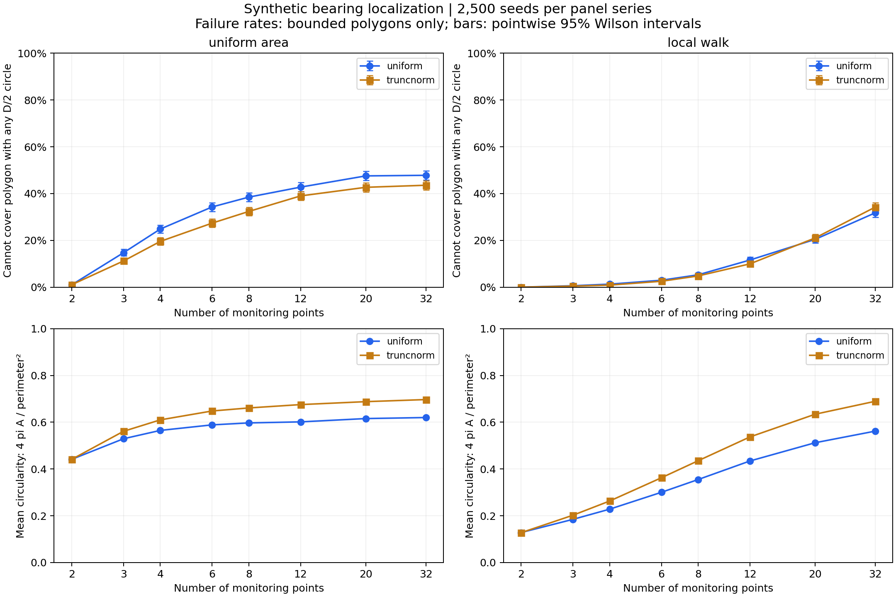
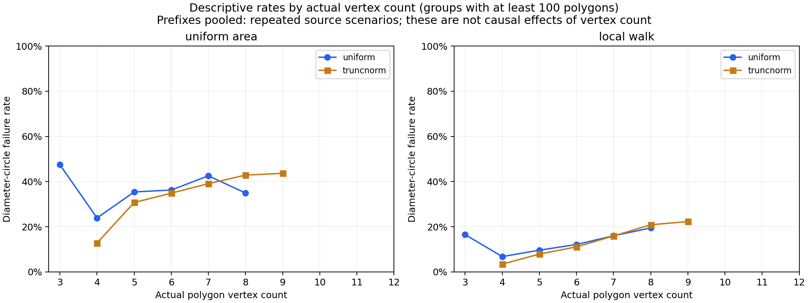
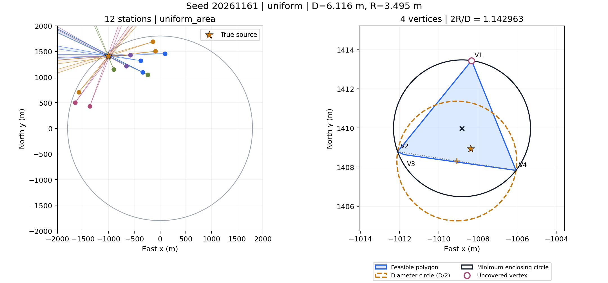
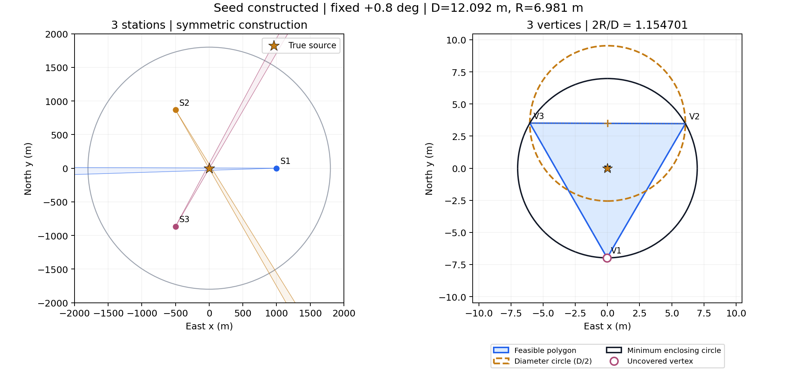

# 直径圆覆盖定位多边形：80,000 组仿真实验

实验日期：2026-09-11。程序、原始统计行和反例坐标均保存在仓库中。结果来自符合题目硬约束的合成环境，不是官方模拟器输出，也不表示真实电磁环境的经验概率。

## 结果

80,000 次交集评估中，79,107 次得到有界多边形，893 次无界；有界结果中有 15,399 次无法被任何半径为 D/2 的圆覆盖。这里 D 是当前定位多边形的直径。不同测点数使用同一场景的嵌套前缀，80,000 次评估并非 80,000 个独立源场景。

- 增加测点后，样本平均圆整度通常增加；但单条测点序列不保证每一步都更圆。
- 增加测点后，直径圆覆盖失败率在本实验中反而上升。“更圆”不等于“可以被 D/2 的圆覆盖”。
- 本次最严重的随机反例是四边形，但来自 12 个测点，且形状接近一个三角形。测点数不等于最终多边形边数。
- 四边形并非统计上最常失败的形状，也不是唯一能达到最坏覆盖比例的形状。三个合法测点可以产生等边三角形定位区域，达到理论最坏比例。

## 正确的覆盖判定

令 P 为有界凸定位多边形，A、B 是它的一对最远顶点，D=|A-B|，M=(A+B)/2。

如果半径 D/2、圆心 O 的圆覆盖 P，则一定覆盖 A、B。由三角不等式：

```text
D = |A-B| <= |A-O| + |O-B| <= D/2 + D/2 = D
```

所有不等式只能取等号，所以 O 必须是 M。因此检查以最远点对中点为圆心的圆，不是随意试一个圆心，而是检查唯一可能的圆心。

只要有一个顶点 V 满足 `|V-M| > D/2`，就不存在任何直径为 D 的覆盖圆。反过来，若所有顶点在圆内，利用圆盘的凸性，整个多边形也在圆内。

程序判定阈值为：

```text
max_vertex_distance_to_M - D/2 > max(1e-8 m, 1e-7 * D)
```

另外求最小包围圆半径 R，记录 `rho = 2R/D`。rho=1 表示直径圆足够；rho>1 表示最小所需半径仍大于 D/2。最小包围圆由至多三个支持点确定，[CGAL 文档](https://doc.cgal.org/latest/Bounding_volumes/classCGAL_1_1Min__circle__2.html)给出了这一性质。程序先检验最远点对圆；失败时枚举非共线顶点三元组的外接圆，选取能覆盖全部顶点且半径最小者。坐标先平移、缩放，以改善数值稳定性。

此枚举方法针对顶点很少的定位多边形，时间最坏 O(m^4)、空间 O(m^3)，不是为大型点云设计。几何求交仍使用原来的半平面裁切函数。所有保存的反例另用独立凸优化核对包围圆半径。

平面 Jung 定理给出 `1 <= rho <= 2/sqrt(3) ≈ 1.1547005`；等边三角形达到上界。[大学讲义](https://www.math.utah.edu/~treiberg/HellySlides.pdf)。一般四边形也可以达到同一比例，例如在等边三角形的一条边外添加一个足够近的新顶点，保留原三个支持点和原直径；所以不能仅按边数给形状严重程度排序。

## 场景生成及统计口径

| 项目 | 设置 |
|---|---|
| 源场景种子 | 20260911 至 20263410，共 2,500 个 |
| 源位置 | 半径 1800 m 圆内按面积均匀生成 |
| 源类型 | 单个全向源 |
| 接收半径 | 每个源随机取 U[1000,1500] m |
| 测向误差 | 均匀 U[-1°,1°]；或零均值高斯截断至 [-1°,1°]，截断前标准差 1/3° |
| 测点数量 | 2、3、4、6、8、12、20、32；同场景采用嵌套前缀 |
| 配置一 | `uniform_area`：在圆域内满足接收距离的区域按面积均匀采样 |
| 配置二 | `local_walk`：相邻测点距离 50–250 m，有方向相关性的随机步行，拒绝越界或不可接收位置 |
| 有效距离 | 每个测点距真实源至少 50 m，且不超过该源接收半径 |
| 同地重复 | 误差由种子和精确坐标固定，不因重测改变 |
| 空间误差相关性 | 未建模；不同精确坐标的误差按独立模型处理 |
| 圆域先验 | 不裁切定位多边形；单独记录多边形是否完全处于目标圆域内 |
| 圆整度 | Q=4πA/L²，A 为面积，L 为周长；圆为 1 |

两种噪声使用相同源位置、接收半径和测点序列；两种配置也复用源种子。比较噪声时几何相同。测点的生成借助真实源位置以获得有效观测，不代表机器人在未知源环境中的可执行搜索策略。

每个固定“配置/噪声/测点数”组内，各源种子独立；图上的误差棒为该组失败率的逐点 95% Wilson 区间。不同测点数之间是配对数据，不能把它们当作独立样本进行比较。按多边形边数汇总时重复汇集同一场景的不同前缀，仅作描述性统计，不画独立样本置信区间，不解释为边数的因果效应。

## 测点数量与圆整度、覆盖失败率

下表为 `uniform_area + uniform`；分母仅包括该测点数下的有界多边形。

| 测点数 | 失败数 / 有界数 | 失败率 | 平均圆整度 |
|---:|---:|---:|---:|
| 2 | 25 / 2454 | 1.02% | 0.441 |
| 3 | 368 / 2498 | 14.73% | 0.529 |
| 4 | 621 / 2500 | 24.84% | 0.565 |
| 6 | 857 / 2500 | 34.28% | 0.589 |
| 8 | 962 / 2500 | 38.48% | 0.597 |
| 12 | 1069 / 2500 | 42.76% | 0.601 |
| 20 | 1189 / 2500 | 47.56% | 0.616 |
| 32 | 1195 / 2500 | 47.80% | 0.620 |



局部步行配置下，均匀误差的失败率从两测点样本中的 0/2155 增加到 32 测点的 794/2500（31.76%）；这不意味着所有两点步行情形都能覆盖。配置和误差模型会影响发生概率。

圆整度均值增加并不代表每次增加测点都会更圆。例如 `uniform_area + uniform` 从 3 点增加到 4 点的 2498 个共同有界场景中，1388 个更圆、747 个更不圆，其余变化不超过阈值。同一转换中，383 个从可覆盖变成不可覆盖，131 个从不可覆盖变成可覆盖。完整配对计数见 `nested_transitions.csv`。

原因是加入约束后 P_new 是 P_old 的子集，面积和直径均不增，但新使用的圆半径也从 D_old/2 缩小为 D_new/2，圆心还可能改变。旧圆仍然覆盖子集，不代表重新缩小后的新直径圆也覆盖它。

此外，圆整度主要描述面积与周长的关系，不等价于中心对称性。矩形和其他中心对称凸区域都可被自己的直径圆覆盖，即使它们非常狭长；看起来接近圆的非对称区域仍可能略微超出直径圆。

## 实际边数与覆盖失败率

以下汇总 `uniform_area + uniform` 的所有测点数前缀：

| 实际多边形边数 | 多边形评估数 | 失败率 |
|---:|---:|---:|
| 3 | 1279 | 47.46% |
| 4 | 8853 | 23.90% |
| 5 | 6005 | 35.42% |
| 6 | 2876 | 36.27% |
| 7 | 773 | 42.56% |
| 8 | 146 | 34.93% |

这里只说明本次采样中的频率，受测点数、配置及噪声共同影响。精确分层结果见 `summary_by_n_and_edges.csv`，避免把“12 个测点得到的四边形”与“两个测点得到的四边形”视作同一个采样条件。



32 个测点时，区域随机配置下最终顶点数中位数仍为 5（均匀误差）或 6（截断高斯）。更多观测不代表每个观测都会留下新的有效边，也没有显示多边形必然趋近圆。

## 最强随机反例：12 个测点，4 个顶点

种子 20261161，配置 `uniform_area`，均匀误差。源、所有测点及整个定位多边形都位于半径 1800 m 的圆域内，因此不是人为计算框或超出目标圆域导致的反例。

```text
定位区域直径 D       = 6.115564682621396 m
直径圆半径 D/2       = 3.057782341310698 m
最小包围圆半径 R     = 3.4949321431934095 m
所需半径比例 2R/D    = 1.142963021264401
```

允许最优选择圆心，也需要比 D/2 大约 14.30% 的半径。以最远点对中点为圆心时，最远的漏出顶点超出圆周约 2.1295 m。该漏出距离与“最优调整圆心后还需要增加的半径”是不同指标。



两测点也找到四边形反例：种子 20261951、截断高斯误差，D≈35.651973 m，R≈17.835528 m，2R/D≈1.00053528。失败较轻，但不支持“两测点四边形一定能覆盖”的结论。见 `two_monitoring_points.png`。

## 可直接写入论文的三测点解析反例

以下是刻意构造的合法观测，不加入随机失败率统计。

设真实源 G=(0,0)，三个测点距 G 都是 1000 m：

| 测点 | 坐标 / m | 真实方向 | 测量方向 | 误差 |
|---|---|---:|---:|---:|
| S1 | (1000, 0) | 180° | 180.8° | +0.8° |
| S2 | (-500, 500√3) | 300° | 300.8° | +0.8° |
| S3 | (-500, -500√3) | 60° | 60.8° | +0.8° |

接收半径取 1200 m，所有测向条件合法。每束楔形较靠近源的边界距源 h=1000 sin(0.2°)，三条有效边由 120° 旋转对称排列，其他三条边界较远，不参与最终边界。交集是以 G 为中心的等边三角形：

```text
内切圆半径 h       = 1000 sin(0.2°)
最小包围圆半径 R   = 2h ≈ 6.981302830 m
多边形直径 D       = √3 R ≈ 12.091971205 m
直径圆半径 D/2     ≈ 6.045985603 m < R
2R/D               = 2/√3 ≈ 1.154700538
```

因此即使圆心任意选择，直径为 D 的圆仍无法覆盖这个定位区域。最小覆盖圆的半径至少要比 D/2 大 15.47%。这一实例证明，合法测向交集并不排除理论最坏的等边三角形。



注意“定位多边形没被完全覆盖”和“当前仿真中的真实源落在圆外”不是同一件事。本构造中真实源仍在直径圆内，但区域内仍有候选位置无法覆盖。程序另外记录了 `source_outside`，并保存了真实源也落在圆外的随机实例。

## 运行与复核

在仓库根目录执行：

```powershell
python -m question1.search_diameter_circle --trials 2500
python -m question1.verify_circle_study
python -m pytest question1/tests -q

# 直接复核仓库保存的本次结果
python -m question1.verify_circle_study question1/experiments/diameter_circle
```

本次批量计算约 104 秒（不含随后绘图和独立复核），具体耗时取决于机器。69 项测试通过；16 个保存反例均经过独立凸优化核对最小包围圆、暴力顶点距离核对直径、测向约束与接收距离检查；80,000 条原始记录与按测点数汇总表已核对。

- `trials.csv.gz`：全部 80,000 条原始统计行。
- `metadata.json`：参数、阈值、依赖版本及统计假设。
- `summary_by_n.csv`：按配置、噪声、测点数汇总及 Wilson 区间。
- `summary_by_edges.csv`：按实际多边形边数的描述性汇总。
- `summary_by_n_and_edges.csv`：同时按测点数与边数分层。
- `nested_transitions.csv`：同场景添加观测后的配对变化计数。
- `examples.json`：反例坐标、读数、误差、顶点、两种圆、直径及支持点。
- PNG/SVG：可直接查看或用于论文制图的反例图和统计图。
