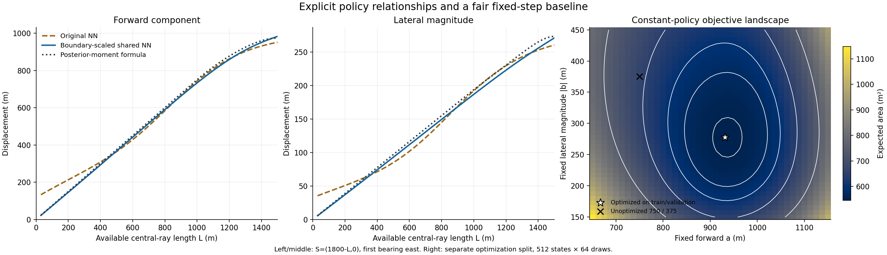
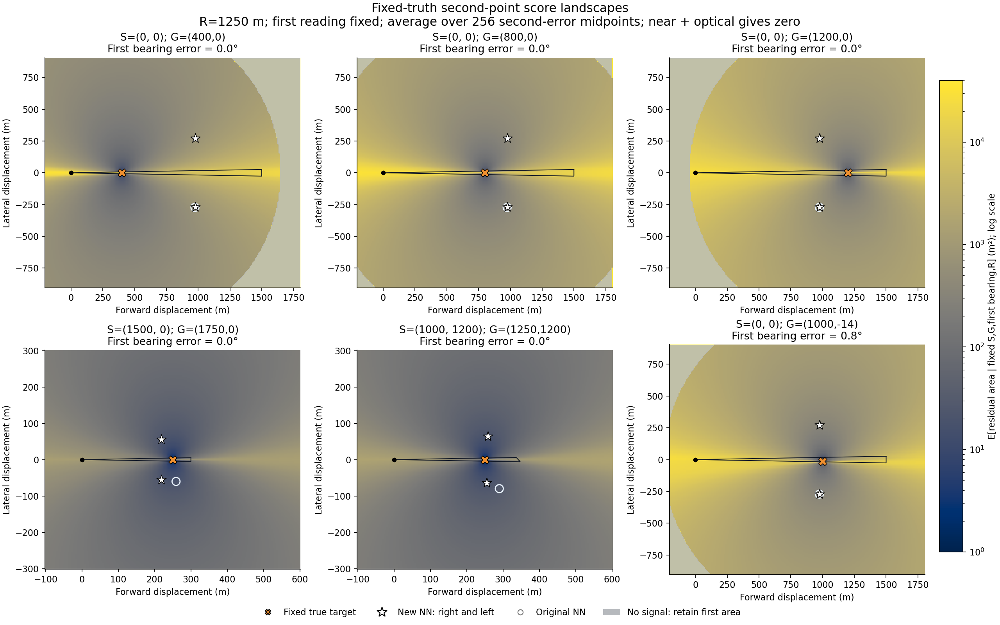

# 第二问补充：训练机制、对称双分支、公平基准与固定真值热力图

本轮保留首版文件和权重，新增 4 个对称网络、4 个不同初值的固定步长优化、一个全新的独立测试集，以及 6 张固定真值得分图。完整交接记录见 [AI_INTERACTION.md](AI_INTERACTION.md)。

## 1. 没有监督标签，网络究竟怎么训练

**当前实际方法是可微模拟器上的直接策略优化。没有“正确第二测点”的监督标签，也没有运行 PPO、DQN 或 REINFORCE。** 从广义决策学习角度可归入模型可微的策略优化，但具体算法是蒙特卡罗条件期望加路径梯度。

一次训练迭代为：

```python
# z: 已得到的第一测点和示向度；不含真实目标
# g: 从 p(G | z) 抽出的环境真值，不传给策略网络
q = policy(z, side)
theta2 = atan2(g.y - q.y, g.x - q.x) + epsilon2
region2 = clip(first_region(z), wedge(q, theta2))
loss = mean(expected_residual_area(region2, no_signal, near))
optimizer.zero_grad()
loss.backward()
optimizer.step()
```

准确的损失实现见上级 [objective.py](../objective.py)；接收半径被解析积分，失联保留第一面积，near 的零损失是在随后完成光学定位之后。首个有效观测必须存在，同位置重测不重新抽误差。

网络学习的是

\[
\min_\phi\;\mathbb E_z\mathbb E_{G,\varepsilon_2,R\mid z}
L(\pi_\phi(z),G,\varepsilon_2,R).
\]

策略输入只有观测；模拟器可以使用 G 来判断第二观测会是什么，这与模拟环境知道隐藏状态并不矛盾。抽样库不是监督学习的最优动作标签库。

本实现可以对评分过程求导：

\[
\nabla_\phi L
=\frac{\partial L}{\partial q}\frac{\partial\pi_\phi(z)}{\partial\phi}.
\]

其中 `partial L / partial q` 包含第二点改变真实方位 `atan2(G-q)`、交会边界、顶点和面积的影响。凸裁切的拓扑判断是离散的，活跃交点和面积在一般位置上分段可微。有限差分测试已经检查几何梯度。近距分支等硬阈值可能涉及边界项，不能仅凭自动微分就宣称对所有分布都存在无偏路径梯度或全局收敛保证。

新方案训练参数：32768 个状态 × 96 个后验样本，每步 192 状态 × 24 样本；4 个共享分支网络分别优化左右两侧，另有 4 个独立初值的常数策略；6000 步约 160.66 秒。优化器为 Adam。各网络损失独立，合并在 GPU 批次中提高效率。候选网络仅凭独立验证集选择。

### 如果真的只有黑箱评分接口

如果接口只返回 `score(z,q)`，不能对内部几何求导，那么上述 `loss.backward()` 无法把这个 Python 返回数值的梯度传到动作。此时可使用：

- **单步策略梯度**：策略输出随机动作 `q~pi_phi(.|z)`，用 `L grad_phi log pi_phi(q|z)` 估计损失梯度，加状态基线降低方差。
- **演化策略或有限差分**：在动作或参数周围做成对扰动，由分数差估计方向；能共享随机数时尽量共享，以降低环境噪声。
- **学评分近似器再优化策略**：用 `(z,q,score)` 训练 critic/代理模型，再验证代理优化误差；不应默认它比直接几何更准。

这里只有一次选点，是 contextual bandit（上下文单步决策），不必引入长回合 PPO。当前代码没有调用黑箱外部评分服务来训练，也没有使用官方模拟器作训练环境。

### 第一问直径能否作为训练目标

可以。若定位区域顶点为 `v1,...,vm`，第一问的目标就是

\[
D(P)=\max_{i,j}\|v_i-v_j\|.
\]

推理时可直接用第一问的旋转卡壳函数求值；训练时可在 GPU 上对很少的顶点批量计算最大顶点对距离，在非退化、最大对唯一等一般位置上反传。它与第一问指标相同，只是并行实现方式不同。若坚持使用只返回直径数值的 CPU 黑箱函数，则改走上面的评分型优化方法。

应该优化 `E[D(P2)]`，不要将 `E[D²]` 当作等价目标；也要为无信号、无界和 near 分支明确定义损失。使用目标圆先验的区域直径，与第一问默认纯两楔形交会直径仍需区分。

**本轮已有权重全部以面积训练；直径改训尚未实施。** 第一问直径目前在上级评价脚本中作为独立核验指标，未假称现有权重已经达到直径最优。

## 2. “解析解”究竟解了什么

此前的闭式公式是局部小角度近似目标的解，完整问题的闭式最优解尚未推导出来；这不是对“不可能有解析解”的证明。

在第一示向度坐标系中，把目标近似为 `(r,0)`，第二点为 `(a,b)`，有

\[
A\approx4\delta^2r\frac{(r-a)^2+b^2}{|b|},\quad
a^*=\frac{E[r^2]}{E[r]},\quad
|b^*|=\sqrt{\frac{E[r^3]}{E[r]}-\left(\frac{E[r^2]}{E[r]}\right)^2}.
\]

上级 `analytic_baseline.py` 的后验矩已经考虑真实圆边界造成的径向截断；仍然使用了近似面积目标，所以不能说它已经精确考虑最终定位区域的圆弧裁切。完整评分还包含两次角误差、区域拓扑、接收失败和近距分支。

应区分两种误差：

1. **解析近似的模型误差**：局部平行四边形面积近似，与最终裁切区域面积不同。
2. **代码中的圆折线近似误差**：训练用外切多边形替代圆弧。另有抽样误差和网络拟合误差，不能混为一谈。

例如 `S=(1500,0),theta=0°`、中心射线可行长度 L=300 m 时，对同一个后验矩策略：局部近似目标约 28.49 m²，完整保守评分约 27.55 m²，差约 3.4%；64 个配对事件的真实圆积分与 1024 边几何平均差仅约 0.00030 m²。这里主要不是圆画得不够细，而是目标公式本身不同。详见 [边界误差审计](../results/symmetry/boundary_audit.json)。这些是具体案例审计，不是所有输入的误差界。

## 3. 正确利用对称性，并把 bool 留给全局规划

令 `p=(p_parallel,p_perp)` 是第一测点在示向度坐标系中的位置，`F(x,y)=(x,-y)`。正确关系是

\[
J(Fp,Fq)=J(p,q).
\]

固定 p 时，`J(p,(a,b))=J(p,(a,-b))` 只有在有效几何/后验关于示向线对称等条件下成立。例如首个完整扇形未被目标圆裁切时成立；圆边界非对称地裁掉一侧时一般不成立。固定真值 G 后，G 若因首个误差偏离示向线，也不能只镜射 q 就要求分数相同。

新网路用同一个分支生成器处理两侧：

\[
(a_\sigma,b_\sigma)=F_\phi(p_\parallel,\sigma p_\perp,L),\qquad
q_\sigma=s+a_\sigma u+\sigma b_\sigma v,\quad\sigma\in\{-1,+1\},
\]

其中 `b_sigma>0`，`u` 是示向度方向、`v` 是左法向，L 为中心射线在目标圆与 1500 m 接收上界内的剩余长度。共享权重保证

\[
q_\sigma(Fp)=Fq_{-\sigma}(p).
\]

不是把两个动作强行平均；平均两个对称的好动作可能回到侧移为零的坏动作。也不是假定非对称状态的 a、|b| 两侧必须相同。

已比较普通共享分支与按 L 缩放输出的共享分支，各训练两个种子。验证集选择了边界缩放版本。测试中的镜射/分支交换坐标最大误差为 0 m（在本次浮点执行中），另有独立镜射评分测试。

调用接口：

```python
from question2.黑箱思路.symmetry.policy import SidePolicy, pi_side

policy = SidePolicy()
choices = policy.options(x, y, theta_deg)
right_point = choices[False]
left_point = choices[True]

# left 来自第三/四问全局地图规划，而非真实目标坐标
next_point = pi_side(x, y, theta_deg, left=True)
```

上层可以综合移动时间、其他目标、后续访问路径、局部定位质量选择 bool。局部训练分别优化两侧，不负责决定哪侧在全局路线中更好；本次评价也没有按隐藏目标逐样本挑低分侧来作弊。`SidePolicy(guarantee_reception=True)` 可复用上级保守接收认证，但其硬保证限于全向源模型；第四问定向源不能直接套用该保证。

## 4. 固定 750/375 并未优化，现在补上公平优化

原来的数字是手设基准，应明确更正。当前对一个全局常数 `(a,|b|)` 优化

\[
\min_{a,b}\;E_z[J((a,-|b|)\mid z)],
\]

从四个初值出发，用同一可微模拟器和训练/验证分离方案优化。验证集选出的步长是 **a=931.53 m、|b|=277.76 m**。四个初值均收敛到附近；这仍是数值优化结果，不是连续全局最优性证明。

这个常数适用于当前总体状态分布；它不是无圆裁切时约 974/273 的那组常数，因为总体中还包括更短的边界状态。

新测试集种子 **23260911**，8192 状态 × 256 后验样本，完全独立于新方案训练、验证与旧测试。结果如下：

| 策略 | 期望剩余面积 m² |
|---|---:|
| 首版网络 | 506.045 |
| 新共享分支：右 | 505.299 |
| 新共享分支：左 | 505.162 |
| 新网路两侧等权平均 | **505.230** |
| 后验矩近似公式 | 505.361 |
| 优化固定步长 931.53/277.76 | **546.117** |
| 手设固定步长 750/375 | 657.978 |

因此新网路比优化固定基准约降低 **7.49%**，而不是把对未优化数字的约 23% 改善当成对最优固定策略的改善。新网路与后验矩公式仅差约 0.13 m²，工程上几乎同一水平，不宜夸大。

配对比较按状态聚类。新共享分支平均比首版减少约 0.815 m²，95% 区间 `[0.687,0.942]`；比优化常数减少约 40.887 m²，95% 区间 `[38.770,43.003]`。这些都是本地合成分布下的结果，不能与旧测试集数字逐项混用。

## 5. 网络是否学成固定步长或显式函数

**在完整扇形没有受到目标圆裁切时，确实接近固定步长。** 新测试中 5556/8192 个状态满足这一条件；因为目标与误差模型各向同性，相关条件后验在局部坐标中相同，理论上的局部最优动作也应相同。

| 全扇形未裁切的状态 | 前进均值 ± 标准差 m | 侧移绝对值均值 ± 标准差 m |
|---|---:|---:|
| 首版网络 | 972.42 ± 5.93 | 271.80 ± 2.09 |
| 新共享分支右侧 | 973.26 ± 2.91 | 270.81 ± 0.46 |
| 后验矩公式 | 973.846，常数 | 273.314，常数 |

当 L 小于约 1000 m，半径存活函数在可行区恒为 1；再忽略 5 m 近区及横向圆裁切，在 `p(r)∝r,0<r<L` 下，上述近似公式进一步化为

\[
a^*\approx\frac34L,\qquad
|b^*|\approx\sqrt{\frac3{80}}L\approx0.19365L.
\]

当 L 超过 1000 m，1000–1500 m 段受到接收半径存活函数降权，关系从线性过渡到无裁切时的常数平台。因此本问题可以理解为“边界下近似按长度缩放，开阔状态接近固定步长”，并非完全不透明的神经网络黑箱。

L 不是一般状态的充分统计量：不同倾斜圆边界即使中心射线长度相同，左右裁切也可能不同。新网络仍保留两个局部位置变量，不能把所有问题压成只看 L 的一维函数。

边界专门检查采用 `S=(1800-L,0),theta=0°`：

| L / m | 首版 NN 面积 | 新共享 NN 面积 | 后验矩策略面积 |
|---|---:|---:|---:|
| 80 | 17.60 | 1.96 | 1.96 |
| 150 | 23.39 | 6.92 | 6.91 |
| 300 | 32.67 | 27.56 | 27.55 |
| 600 | 111.63 | 110.18 | 110.36 |
| 1000 | 303.84 | 303.64 | 304.42 |

新结构修复了首版在很短边界状态上不愿缩短步长的明显缺陷。该表是独立条件抽样比较，接近的数值不作无误差排名。



## 6. 固定首测点和真实目标的得分热力图

已生成六个场景：首点在原点且真值目标距离 400/800/1200 m、边界朝外、斜向圆边界、首个示向度有 0.8° 误差。

每张图固定 **S、G、首次读数、真实 R=1250 m**，只对第二误差的 256 个中点求积。横纵轴是相对首个示向度的前进和侧移，颜色表示期望剩余面积，越小越好；灰色是失联并保留第一面积，星号为新网络两侧输出，空心圆为首版，橙色叉为真值目标。采用对数色标；near 后光学成功区域真实损失为 0，在颜色中以最低档显示。

这是**真值固定后的诊断图**，不是策略在未知 G 时能直接看到的评分面。第一行即使改变真实目标，策略也收到相同首轮输入，所以输出保持相同，正是没有真值泄漏的体现。若真值已知，移动到目标 5 m 内自然是零终端不确定度，这个平凡最优点不能作为网络可获得的监督答案。

这里没有同时对首次误差平均；最后一张是首个有偏读数已经给定后的切片，允许不对称。策略训练对应的评分还需对 `p(G|z)` 平均，因此不能把单个真值图上不是最低点解释为策略训练失败。



所有逐点数值保存在 `../results/symmetry/fixed_truth/*.csv`，场景元数据在 `cases.json`。图和策略计算的是声明过的保守剩余区域，而不是额外利用全部无信号信息后的最小贝叶斯不确定度。

## 7. 复现与跨工具交接

```powershell
$env:MKL_THREADING_LAYER='SEQUENTIAL'
$env:NUMBA_NUM_THREADS='12'
python -m question2.黑箱思路.symmetry.train
python -m question2.黑箱思路.symmetry.evaluate
python -m question2.黑箱思路.symmetry.fixed_truth
python -m question2.黑箱思路.symmetry.diagnostics
python -m question2.黑箱思路.symmetry.plot
python -m question2.黑箱思路.verify
```

新权重在 `../checkpoints/symmetry/best.pt`，旧权重未覆盖。首次测点仍限于圆内训练，第四问定向模型与直径损失训练尚未实现。其他工具接手先读本方案 [AI_INTERACTION.md](AI_INTERACTION.md)，以及项目根目录的总索引和 AGENTS.md。
