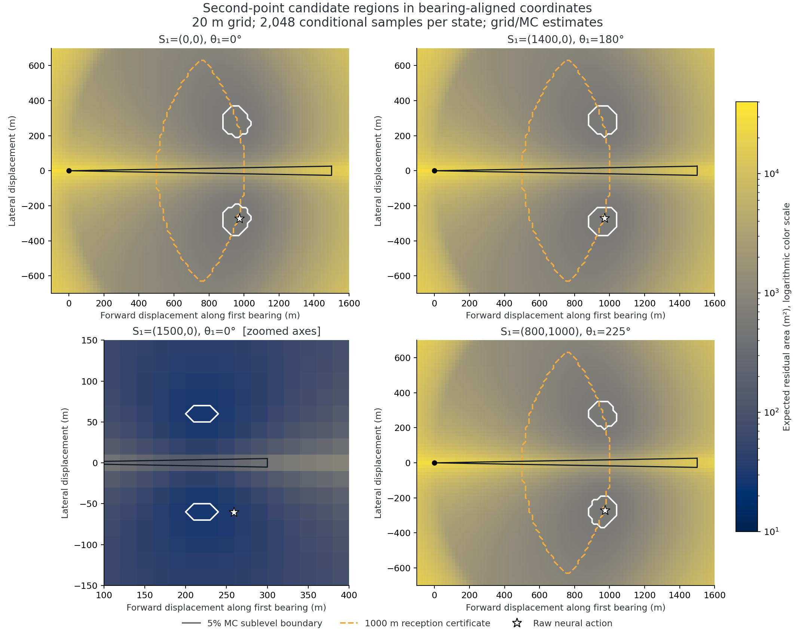
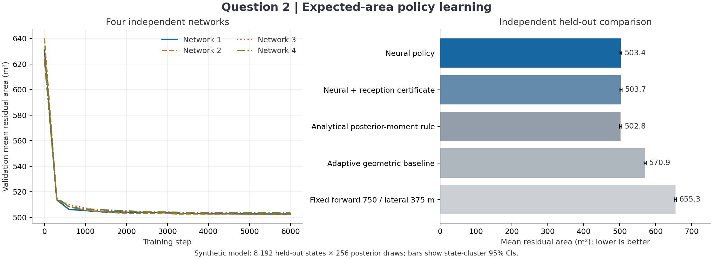

# 第二问：黑箱神经网络选点的可行性与已完成实验

后续补充见 [对称结构与训练机制报告](symmetry/README.md)：明确解析公式是近似目标的解；优化原先未优化的固定基准；新增外部 bool 选边接口、固定真值热力图和边界缩放网络。本篇保留首版实验结果，两个测试集不混用。

## 1. 结论与任务定位

策略 `pi(x,y,theta) -> (x_next,y_next)` 可以实现，并且可以直接利用可微几何和蒙特卡罗条件期望训练，不需要先获得“最优第二点”的监督标签。本目录已完成实际训练和独立评价。

在本文明确设定的合成概率模型下，网络平均剩余面积为 **503.42 m²**，比固定前进 750 m、侧移 375 m 的基准降低 **23.17%**；增加保守接收证书后为 **503.68 m²**。进一步推导的后验矩解析策略得到 **502.76 m²**，略优于网络。因此，实验支持“黑箱可训练、能得到有效策略”，不支持“黑箱必然优于解析建模”。

本实现处理的是第二问单目标、已经获得一次示向度后的选点；没有训练第三问的全域搜索、多目标清除或时间最优策略。所有实验均在本地合成环境中完成，未使用官方模拟器、未调用其测试接口。

## 2. 题目硬条件与额外假设

依据仓库 [B题.pdf](../../B题.pdf) 第 1 页问题 2、第 2–3 页附录 2，以及 [附件1.docx](../../附件1.docx) 的移动和检测规则：

| 项目 | 题目给定内容 | 本实现处理 |
|---|---|---|
| 目标位置 | 半径 1800 m 的圆域内 | 目标始终按真实圆域生成 |
| 全向信号 | 所有方向均可辐射 | 不引入定向遮挡 |
| 接收半径 | 每个目标固定，位于 1000–1500 m | 同一目标的两次观测共用同一个隐藏半径 |
| 示向度误差 | 位于 ±1° | 默认均匀误差，另做截断正态敏感性实验 |
| 同位置重测 | 误差固定 | 重测保留第一定位区域，不重新获得独立信息 |
| 5 m 以内 | 返回 `near`，没有示向度 | 进入光学定位分支，不伪造第二个方向 |
| 20 m 以内 | 可以光学定位并清除 | 面积目标不等同于确保进入 20 m |
| 第二测点 | 可以超出目标圆域 | 不把机器人错误限制在半径 1800 m 内 |
| 移动与检测 | 5 m/s；检测需停车并耗时 5 s | 单独报告移动距离；本问损失未计时间 |

以下是建模选择，题目没有给出这些概率分布：

1. 目标 `G` 在目标圆域内按面积均匀；第一测点 `S` 也独立按圆面面积均匀生成，然后筛选确实收到示向度的案例。
2. 隐藏接收半径 `R ~ Uniform(1000,1500)`，与两者的先验位置独立。
3. 不同坐标的误差独立且默认 `Uniform(-1°,1°)`；相同坐标必须使用同一个误差。该假设没有声称真实电磁误差场具有独立性或空间连续性。

“先验上目标与测点独立”不能延伸为“收到示向度以后仍独立”，更不能要求策略选出的第二测点与目标条件独立。

## 3. 为什么目标后验通常不是整个扇形内均匀

记 `D={g: ||g||<=1800}`，`r=||g-s||`，首个观测为 `z=(s,theta,direction)`，角差按圆周取到主值。贝叶斯公式给出

\[
p(g\mid z)\propto
\mathbf1_D(g)\,\mathbf1_{r>5}\,
f_\varepsilon\!\left(\operatorname{wrap}(\theta-\arg(g-s))\right)
\Pr(R\ge r).
\]

默认均匀半径先验的存活函数是

\[
w(r)=\Pr(R\ge r)=
\begin{cases}
1,&r\le1000,\\
(1500-r)/500,&1000<r\le1500,\\
0,&r>1500.
\end{cases}
\]

均匀角误差只会让角似然在 ±1° 内为常数。1000–1500 m 范围仍受到 `w(r)` 衰减，所以**一般不在整个可行扇形内等可能**。如果接收半径是已知常数、目标先验是圆面均匀且角误差均匀，则后验才在相应圆域与扇形的交集、去掉 5 m 近区后按面积均匀。

以首个示向度为极轴，`g=s+r(cos(alpha),sin(alpha))`，面元为 `r dr d alpha`，于是

\[
p(r,\alpha\mid z)\propto r\,w(r)\,
f_\varepsilon(-\alpha)\,
\mathbf1_{\{g\in D,\;r>5\}}.
\]

因此不能把半径直接均匀抽样。实现中先按角误差密度抽角度、按半径平方均匀抽半径，再依据真实圆域和 `w(r)` 接受/拒绝；圆边界附近使用可证明的状态相关半径上界提高接受率。训练状态也从独立位置先验筛选有效首次观测，避免先看真实目标再任意挑测点而改变所声明的状态分布。

## 4. 第二次观测必须共享同一接收半径

给定候选目标 `g` 和首次有效观测，隐藏半径的条件分布为

\[
R\mid g,z\sim U(\ell(g),1500),\qquad
\ell(g)=\max\{1000,\|g-s\|\}.
\]

对第二点 `q`，令 `d_2=||g-q||`。解析积分后，第二次接收概率是

\[
p_{\rm recv}(g,q)=
\operatorname{clip}_{[0,1]}
\frac{1500-\max\{d_2,\ell(g)\}}{1500-\ell(g)}.
\]

这是本实现降低随机方差的关键：不需要给同一源重新抽一个独立接收半径。若第二点有效，观测为

\[
\theta_2=\arg(g-q)+\varepsilon_2,\qquad |\varepsilon_2|\le1^\circ.
\]

只有 `q != s` 时，默认独立误差假设才允许生成新的误差；`q=s` 必须保留原示向度。程序显式处理了重测分支。

## 5. 面积目标的精确定义

设 `W(s,theta)` 为首个前向 ±1° 楔形。为避免两楔形相交无界，先使用题目允许的有限先验区域

\[
K_1=D\cap B(s,1500)\cap W(s,\theta).
\]

若第二点得到方向，评分区域取

\[
K_2=K_1\cap W(q,\theta_2).
\]

这里有三个必须保留的区别：

- **纯交会多边形**是 `W1 ∩ W2`，可能无界；不能偷偷用计算方框把它截成有限面积。
- 加上真实圆域后的 `K1、K2` 可能含圆弧，并非严格的多边形。
- 本实现使用外切多边形近似圆弧，所以训练面积是对所选连续区域的保守近似，不是凭空声称圆弧等于折线。

训练时目标圆使用 256 条外切边；第一接收圆在窄扇形内使用朝向 0°、±1° 的三个切线约束。没有使用内接多边形排除真实目标。后验抽样使用真实圆，不使用该几何近似。

为了保留凸几何，面积评分没有扣除第一点 5 m 近区；其最大面积差仅为 `(2°/360°)π·5²≈0.436 m²`。抽样时严格排除这个近区。评分也没有继续利用“第二点接收半径不超过 1500 m”对应的第二个圆约束，因而仍是保守定位区域。

不能把第二点失联当成“交集为空、面积为零”。采用可实际执行的保守损失：

\[
L(q,g,\varepsilon_2)=
\begin{cases}
0,&d_2\le5\quad\text{且随后完成光学精确定位},\\
|K_2|,&5<d_2\le R,\\
|K_1|,&d_2>R.
\end{cases}
\]

失联分支保留首轮区域，未利用 `no_signal` 进一步剪枝；因此这是明确定义的“保守剩余区域”目标，不是所有观测信息充分利用后的贝叶斯最小不确定度。`near` 的零损失是完成光学定位后的终端状态，不代表仅凭 `near` 观测就精确知道坐标。

每个给定首轮状态的选点问题为

\[
q^*(z)=\arg\min_q J(q\mid z),\qquad
J(q\mid z)=\mathbb E_{G,\varepsilon_2,R\mid z}[L].
\]

网络参数通过最小化训练状态上的 `E_z[J(pi_phi(z)|z)]` 学习。损失使用真实面积均值，未换成对数面积、像素重合率或面积比。除非附加接收证书，否则这是期望准则，不是零失联硬约束。

## 6. 策略结构、梯度与并行实现

对外输入是三参数 `x,y,theta`。内部令 `u=(cos(theta),sin(theta))`、`v=(-sin(theta),cos(theta))`，计算

\[
h(z)=(s\cdot u,\ s\cdot v)/1800,
\qquad (a,b)=3000\tanh(\mathrm{MLP}_\phi(h(z))),
\qquad q=s+a u+b v.
\]

这只是利用圆域与各向同性假设的旋转对称性去除冗余，避免角度 0°/360° 的断点。没有将真实目标坐标、真实方向、隐藏半径或测试目标统计量喂给网络。第二点与首点的两个局部坐标差限制在 ±3000 m；超过首点 3000 m 的点无法与任何首轮可能目标保持 1500 m 以内接收，因此这一大窗口涵盖有用动作。

网络为 `2→64→64→2`，隐藏层使用 Tanh。四个独立初始化网络分布在正负侧向分支，以相同随机样本分别计算损失；只合并批次提高 GPU 吞吐量，不混合各网络参数。

Sutherland–Hodgman 半平面裁切的顶点连接关系是离散的，但活跃边交点坐标和鞋带面积公式在拓扑不变时可微。实现直接反向传播这些几何导数，并通过有限差分检查。拓扑切换处不可微、`near` 的硬阈值和数值浮点误差意味着这不是全局收敛保证；本次网络结果中未出现近距分支，因此该分支的边界梯度没有决定已报告策略表现。

接收概率已解析积分，避免再对“有信号/无信号”伯努利结果采样；同批不同策略使用共同随机数比较。没有训练高成本的强化学习长回合，也没有把真实目标偷偷当作监督标签。

## 7. 第二检测点的候选区域

### 7.1 可证明接收的保守候选区域

对首次几何外包络 `Khat1`，定义

\[
C_{1000}(z)=\bigcap_{g\in\widehat K_1}B(g,1000).
\]

只要 `q∈C1000`，对所有真实可行目标都有 `||q-G||<=1000<=R`，所以不可能因为超出接收半径失联。因为到固定点的距离是凸函数，只需检查凸多边形的所有顶点：

\[
\max_{v\in\operatorname{Vert}(\widehat K_1)}\|q-v\|\le1000.
\]

它是充分条件，通常比利用首轮接收信息的完整鲁棒条件 `||q-g||<=max(1000,||g-s||)` 更保守。若要严格保证返回 `direction` 而非 `near`，还需排除距任意可行目标不超过 5 m 的点，即再要求 `dist(q,K1)>5`；本版证书保证接收或近距可定位，不声称排除了近距分支。

`safe_pi` 先计算原始神经网络动作，再沿该动作与 `s+750u` 的连线做二分修正，直至满足顶点证书，并留出 1.5 mm 数值裕量。窄扇形在 1500 m 内的外包络到 `s+750u` 的最大距离小于 1000 m，所以这个锚点始终提供可行回退。本版本不是对整个交集做欧氏最近点投影，而是沿指定线段选取最近的可认证点。

### 7.2 期望面积接近最优的候选区域

定义有限搜索集合上的 5% 次水平集：

\[
\widehat C_{5\%}(z)=\{q\in\mathcal G:
\widehat J(q\mid z)\le1.05\min_{\tilde q\in\mathcal G\cup\{\pi(z)\}}\widehat J(\tilde q\mid z)\}.
\]

程序先在局部位移 `[-3000,3000]²` 上做 100 m 粗网格，再在前向 `[-250,1750]`、侧向 `[-1000,1000]` 上做 20 m 网格；每点使用 2048 个条件样本。所有网格点原始坐标、面积估计、蒙特卡罗标准误、失联概率和两个候选标志均已导出。

这个 5% 区域是有限网格和有限抽样的估计，不是连续全局最优域的证明。特别是两侧通常存在两个分离的低损失区域，**不能把 x、y 的最小最大值组成一个实心矩形，声称矩形内全部候选点都好**。

原点向东案例中，网络选择 `(974.64,-271.97)` m；5% 候选网格的前向范围约 890–1030 m、两侧分别出现低面积小区域。候选外包坐标的侧向范围为 -360–360 m，但靠近侧向 0 m 的共线区域并不属于优选区域。`safe_pi` 给出约 `(965.40,-260.78)` m。

四个例子均对网格最优点和网络点另抽 8192 个样本复核，避免把选点时的样本最小值当作无偏性能估计。边界向外例子 `S=(1500,0),theta=0°` 中，独立复核网络约 32.66 m²，网格点约 27.80 m²，网络仍有约 17.5% 的相对差距。

## 8. 解释网络学到的几何规律：后验矩解析基准

这一节是我们从局部小角度近似推导的可解释基准，不是题目给出的公式。令目标近似位于首个示向线 `G=(r,0)`，第二点 `q=(a,b)`，两个视线的交角为 `phi`，角半宽 `delta=π/180`。局部交会面积近似为

\[
A\approx\frac{4\delta^2r_1r_2}{|\sin\phi|}
=4\delta^2 r\frac{(r-a)^2+b^2}{|b|}.
\]

所以“交角接近 90°”仅是在距离固定时有帮助；第二点改变了 `r2` 和接收概率，不能单独把交角最大作为总体最优原则。

忽略失联、圆边界对最终小区域的裁切等影响，令 `m_k=E[r^k|z]`。对期望面积先关于 `a` 再关于 `|b|` 求导，得到

\[
a^*=\frac{m_2}{m_1},\qquad
|b^*|=\sqrt{\frac{m_3}{m_1}-\left(\frac{m_2}{m_1}\right)^2}.
\]

本目录 `analytic_baseline.py` 使用正确的 `r w(r)` 径向权重、真实圆边界及 64 点角向高斯求积计算这些矩，没有读取测试目标。对原点向东，公式给出约 `(973.85,±273.31)` m，与训练网络 `(974.64,-271.97)` m 极接近。

这解释了训练为何快速收敛，也说明在第二问目前这个低维、对称的设置下，神经网络并非唯一高效方案。解析公式仍是近似，不能由其数值好就把局部近似公式写成全局最优性证明。

## 9. 已完成的训练与独立验证

### 9.1 配置和计算量

| 项目 | 配置 |
|---|---|
| 训练状态 | 32,768 个，种子 20260911 |
| 每状态后验库 | 128 个样本，共 4,194,304 个目标条件样本 |
| 验证集 | 独立 1024 状态 × 128 样本，种子 20360911 |
| 网络数量 | 4 个独立初始化、两侧分支 |
| 训练步数 | 每个网络 6000 步 |
| 每步 | 256 状态 × 32 条件样本 × 4 网络 |
| 优化器 | Adam，学习率从 8e-4 余弦降至 4e-5 |
| 硬件 | NVIDIA GeForce RTX 4060 Laptop GPU |
| 框架 | PyTorch 2.9.0+cu126 |
| 本次训练耗时 | 85.32 秒，含数据生成和验证 |
| 峰值 PyTorch 分配显存 | 约 120.51 MiB，不等同于驱动报告的总占用 |
| 最终选模 | 仅凭验证集，模型 1、5700 步检查点 |

累计约 1.966 亿次“策略—条件样本”损失计算；四个网络共享批次样本，这不是 1.966 亿个独立场景。CPU 使用 12 线程生成几何数据，GPU 批量裁切与反传。相同参数和随机种子可复现实验流程；CUDA scatter 等操作不承诺跨驱动逐比特相同结果。

### 9.2 独立测试

测试集种子 20460911，包含 8192 个独立首轮状态，每状态 256 个目标/误差样本。置信区间以“状态”为聚类单位计算，未错误地把一个状态下的全部目标样本当成独立状态。不同策略使用相同状态和随机数作配对比较。

| 策略 | 平均剩余面积 m² | 平均移动 m | 失联概率估计 |
|---|---:|---:|---:|
| 神经网络 | 503.42 | 944.30 | 4.42e-7 |
| 神经网络加接收证书 | 503.68 | 937.64 | 0；另有几何保证 |
| 后验矩解析基准 | 502.76 | 947.91 | 3.27e-7 |
| 自适应几何基准 `(0.60L,0.28L)` | 570.90 | 910.00 | 0，仅本次估计 |
| 固定 `(750,375)` m | 655.25 | 838.53 | 0，仅本次估计 |
| 纯侧向移动 500 m | 6613.67 | 500.00 | 13.06% |
| 沿示向线前进 750 m | 4258.19 | 750.00 | 0，仅本次估计 |
| 原地重测 | 33878.35 | 0 | 0，仅本次估计 |

自适应基准中的 `L` 是首次外包络的最大前向坐标，由观测几何计算，不是目标真实距离。为所有基准使用同一保守剩余面积定义。

网络均值的状态聚类 95% 区间为 **[500.67,506.17] m²**。相对固定斜向基准，配对面积减少 **151.83 m²**，95% 区间 **[150.95,152.71] m²**。相对自适应基准减少 **11.82%**。后验矩策略的均值略低于网络，不能忽略这个强基准只展示与弱基准的改善。

网络动作约 3.27% 位于目标圆域外，这在题目中是允许的。面积极小的失联概率来自所选先验下的解析条件概率平均，不是官方环境中的失联频率，也不是零失联证明。

### 9.3 几何与数值核验

复用了第一问独立的半平面实现对 256 个测试状态、1024 次第二方向事件进行核验：所有事件都包含真实目标；这些事件中纯两楔形相交均有界。含先验区域的直径中位数约 **49.50 m**，95% 分位数约 **102.27 m**。这说明面积目标不错，并不等于第二问之后可以保证一次进入 20 m 清除范围。

以更密的 2048 边目标圆外包络和第一问独立裁切作为参考，面积平均绝对差 **0.0102 m²**，最大差 **1.6529 m²**。另对 256 个事件直接进行真实双圆约束的连续极坐标积分，不使用圆多边形化：平均绝对差 **0.0076 m²**，最大差 **0.6777 m²**。这些是抽样审计结果，不是所有输入的统一误差界。

程序测试覆盖：GPU/CPU 面积一致性、真值包含、几何梯度有限差分、原地重测、失联不伪造零损失、正确径向后验、旋转等变性和角度周期性、顶点接收证书、外包络嵌套、真实圆积分及解析矩。第一问原有测试也一并运行，具体最后一次结果见 `results/verification.json`。

### 9.4 分布敏感性

不重新训练网络，改变生成数据的真实分布进行压力测试；每种情况使用 2048 状态 × 128 样本。损失区域仍使用统一的未知半径上界 1500 m，模拟部署策略不知道真实半径分布已经变化的情况。

| 真实噪声与半径分布 | 网络 m² | 固定 `(750,375)` m² | 后验矩基准 m² |
|---|---:|---:|---:|
| 截断正态误差，半径均匀 | 507.10 | 659.32 | 506.12 |
| 均匀误差，半径固定 1000 m | 416.00 | 375.92 | 418.50 |
| 均匀误差，半径固定 1500 m | 675.56 | 968.80 | 671.75 |

1000 m 情况下固定基准优于网络。原因是网络按更长距离仍有后验质量的默认先验学习，目标范围变短后，原动作会偏远。题目没有给出真实接收半径分布，不能把默认均匀先验下的最优策略宣称为题目所有合法环境的最优策略。误差空间相关性与额外读数舍入尚未建模。

## 10. 使用建议与边界

当前成果可以作为第二问的完整数值建模支撑：给出条件分布、单步期望面积问题、训练策略、可证明接收的候选域以及有限网格的近优候选域。若论文需要可解释公式，后验矩解析基准具有更直接的表达；网络可作为数值验证或后续复杂场景的扩展基础。

本版网络的首个测点训练域仅为 `||s||<=1800`。题目实际允许机器人走到圆域外，圆外首测点不在当前网络的验证范围，不能外推已报告的精度。对于圆内少见的边界向外状态，候选网格也已经揭示网络不足。后续若扩展，应增加这些状态的覆盖，重新保留独立测试集，而不是继续拿当前测试集选模型。

要服务第三问，需另行加入移动时间、检测成本、当前历史后验与光学可清除概率；只用第一点 `x,y,theta` 无法表达多次观测后的全部信息。面积最小和任务时间最短是不同目标，本实验没有将两者混为一谈。

## 11. 证据与复现入口

- 题目硬条件：[B题.pdf](../../B题.pdf)、[附件1.docx](../../附件1.docx)、[附件2.docx](../../附件2.docx)。
- 训练：[config.json](results/config.json)、[training.csv](results/training.csv)、[training_summary.json](results/training_summary.json)。
- 独立测试：[evaluation.json](results/evaluation.json)、[comparison.csv](results/comparison.csv)、[heldout_state_results.npz](results/heldout_state_results.npz)。
- 候选域：[原点向东](results/candidates/origin_east.json)、[边界向内](results/candidates/edge_inward.json)、[边界向外](results/candidates/edge_outward.json)、[斜向案例](results/candidates/oblique.json)；同名 CSV 包含全部逐点结果。
- 实现依据：PyTorch 官方 [自动微分说明](https://docs.pytorch.org/docs/autograd)。本实验调用普通自动微分和批量张量操作，没有依赖最新文档中的特定新版本 API。
- 运行说明：[README.md](README.md)、[run.ps1](run.ps1)。
