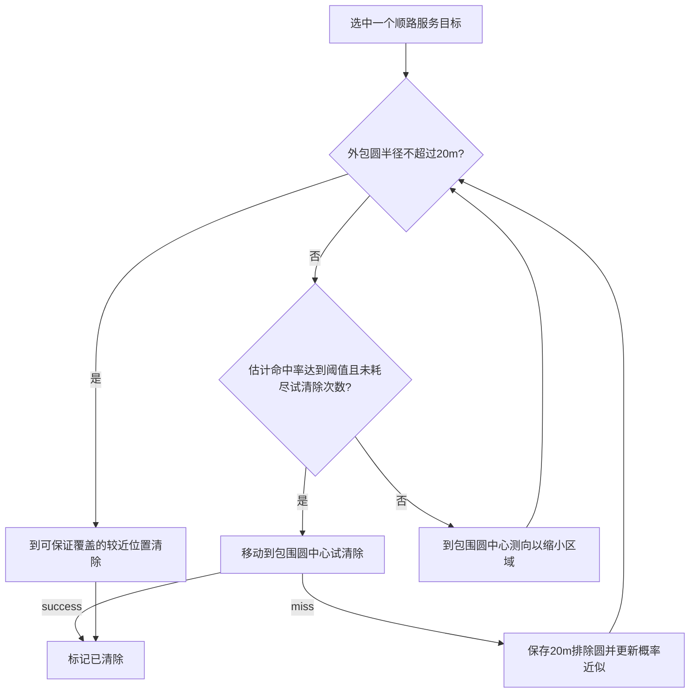

# 第三问：参数化探索、定位与沿途清除

**最新改进版入口：[dynamic/README.md](dynamic/README.md)。用户已取消固定1400m外环要求，新版采用动态覆盖前沿、分区清空和局部rollout比较；100场本地配对结果为279.28s/源。下文保留的是429.27s/源固定环基线的历史说明，不是当前推荐运行入口。**

**新增研究：[经典图算法、补测价值、内圈/分块/全局路线及理论下界](route_study/README.md)，含17种方案20场配对筛选、30场独立验证和[交互对照图](route_study/outputs/comparison.html)。小幅改善未证明稳定，dynamic默认策略保留。**

更新：2026-09-12。已实现并完成本地验证，默认参数尚未优化。

**当前测试约束：不允许使用任何正式测试次数。当前只运行本地仿真，待用户分析结果、改进函数逻辑和优化参数后，再按用户后续指示连接官方演练。本轮没有新增官方演练或正式测试。**

## 1. 为什么之前200秒、后来300秒

两者都是“原点已有某单目标示向度之后”的局部实验。约201秒版本允许试清除并承担少量失败；约307秒版本为了证明最多三次补测后一定能用r20圆覆盖，限制第一测点进入一个保守可行子集，侧移约488m，后续又固定采用圆心测向。因此大侧移和保守续策导致绕路，不是同一算法优化后反而提速。

本全局实现采用**默认前进550m、侧移70m**，并把多个目标的探索和清除合并考虑。下面的429.27秒是“完整全图任务总时间/真实源数”的局均值，包含原点扫描、未知目标搜索、切频、移动和清除，不能直接与单目标201秒比较。

## 2. 对用户六步流程的实现和修正

1. **原点扫描全部20频道。**每个频道保存状态、原始观测、正向测向约束、最小包围圆和排除圆。状态更新只使用命令响应。
2. **朝方位密集方向小幅斜前移动。**用圆周高斯核统计已发现目标的初始方位密度；在该方向左右两侧的小侧移候选中，选对多源综合定位更有利的一侧。没有采用600m侧移。
3. **选择性补测。**前半侧优先；后半侧乘0.35权重。用交会角与接近带来的几何收缩同时评分，不硬性剔除共线：共线的视差低，但接近或越过目标可能有效缩短距离歧义。
4. **小区域就近服务。**ρ≤60m才进入普通清除路线候选；另外，若ρ≤300m但包围圆中心几乎就在前往下一站的路上，可插入一次局部定位/清除服务，默认允许这类插入增加不超过100m的名义路线长度。后者避免等到环走完才折返处理沿途粗定位目标。
5. **约1400m外环补齐搜索。**默认6个等角度观测站，起始相位与密集方向相连，顺/逆时针按现有目标分布选择。外环站优先扫描仍未出现且尚未覆盖完整地图的频道，并补测有信息收益的已知频道。
6. **滚动重排、最后补洞。**每清除一个目标都更新记录和路线，停留点也可顺便扫描新区域。外环结束后检查逐频道连续覆盖证书；有空洞就补测，没有空洞再清理剩余已知目标。退出条件不是“已经走了一圈”。

### r60不是两击保证

即使某目标候选区被半径60m圆覆盖，也不能保证两个半径20m的清除圆覆盖全部候选区。当前局部处理分支为：



默认允许每源最多2次**失败的冒险清除**，之后继续测向直到可认证r20再清除；总clear次数可能大于2。到过相同位置且已失败的clear不重复发送。同点测向误差固定，禁止把原地重测当作新独立信息。

### 凸多边形和真正候选集合必须区分

测向扇形、地图圆域、接收距离上界的交集是凸的；但 `no_signal` 会排除一个至少1000m的接收圆，clear失败会排除一个20m圆，扣除后可能非凸或不连通。

因此每个目标同时维护：

- `polygon`：保守凸外包，用于安全的最小包围圆认证；用第一问的半平面裁切与最小包围圆函数。
- `exclusions`：无信号和clear失败的排除圆。
- `particles/weights`：凸区域内面积样本，结合排除区和未知接收半径可行区间，估计命中概率。

粒子只是决策近似。命中概率没有拟合官方误差分布，也不是完整精确贝叶斯后验：它主要采用角度可行域与半径区间权重，没有逐条积分全部舍入似然。粒子耗尽时禁用冒险clear，几何安全收尾继续有效。

所有圆域通过外切多边形约束近似，始终向外包，不用内接多边形裁掉可能真值。误差角取1.005°，含0.01°舍入余量。最小包围圆取保守多边形顶点，圆盘凸性保证覆盖整个凸外包。

## 3. 每个函数负责什么

### 数据和几何：model.py

| 函数/类 | 输入 → 输出或状态变化 | 作用 |
|---|---|---|
| `Parameters.validate` | 参数对象 → 合法参数 | 检查阈值、步长、权重、类型范围；物理规则不参与调参 |
| `Target.update_measurement` | 位置、检测JSON → 目标记录 | 记录direction/near/no_signal，裁切多边形、更新包围圆 |
| `Target.update_clear` | 位置、清除JSON → 状态 | 成功标记cleared；失败保存排除圆并更新概率近似 |
| `Target.refresh_particles` | 几何、历史 → 样本及权重 | 面积采样，剔除不相容目标，按可行接收半径区间加权 |
| `Target.hit_probability` | 拟清除位置 → 概率近似 | 给试清除分支使用；有整体覆盖证明时直接返回1 |
| `Target.robust_clear_point` | 当前机器人位置 → 保证清除点 | 在B(c,20−ρ)中选离当前点较近的点，不必总走到圆心 |
| `Coverage.mark/gain/complete` | 频道、观测位置 → 覆盖证书 | 标记完整单元被1000m接收圆覆盖、计算新增覆盖、检查无漏扫 |
| `World.finished` | 公共记录 → bool | 所有已发现目标已清除，所有剩余未知频道均有全域覆盖证书 |

`clip_circle_outer`、`sample_polygon`是几何辅助函数；未把源真值引入策略。`Target.measured_at`用于禁止重复地点虚假增益。

### 可替换的决策函数：decisions.py

| 函数 | 判断内容 | 主要可调参数 |
|---|---|---|
| `choose_dense_heading` | 哪个方向已知目标较密集 | `density_sigma_deg`, `heading_candidates` |
| `choose_initial_probe` | 第一小步的位置与左右选边 | `initial_step`, `initial_lateral` |
| `localization_value` | 一个频道在候选点的补测收益 | `information_weight`, `proximity_weight` |
| `select_known_channels` | 停下后补测哪些已知源 | `max_known_scans`, `known_score_min`, `rear_scan_weight` |
| `select_unknown_channels` | 此处扫描未知频道是否值得 | `unknown_gain_min`, `coverage_weight`；外环强制补齐 |
| `choose_ring_route` | 外环节点与顺/逆时针顺序 | `ring_radius`, `ring_nodes` |
| `plan_cleanup_route` | 哪些目标值得插入当前→下一站路线 | `service_radius`, `probe_service_radius`, `max_detour`, `probe_detour_max`, `route_detour_budget`, `route_batch`, `cleanup_weight` |
| `choose_clear_or_probe` | 保证清除/冒险清除/进一步测向 | `trial_probability_min`, `max_speculative_clears`, `service_radius` |
| `choose_coverage_patch` | 残余未覆盖区域的补测点 | `coverage_cell`及距离/收益评分 |

已知频道补测评分的核心是：接收可能性 × 不确定性权重 × max(交会角收益,接近收缩收益) / 检测与切频时间，再乘前/后半侧权重。交会项含 `sin²α`，接近项用“在候选点测向后扇形可被圆覆盖”的上界估算。它是明确的启发式分数，不宣称等于真实信息熵或精确期望时间收益。

路线采用**最小增量插入＋端点固定2-opt＋每次实际服务后滚动重规划**。插入代价为

\[
\Delta L=\|s-c_i\|+\|c_i-w\|-\|s-w\|,
\]

其中w为下一探索站。多个目标时按当前路径段计算插入量，并对短路线做2-opt。阈值约束的是规划时包围圆中心的名义绕行量；实际补测会改变位置，故每次服务后重新规划，不能把一个局部预算当作整局总绕行保证。

### 执行与评估：runner.py / evaluate.py

| 函数 | 作用 |
|---|---|
| `Planner.execute` | 唯一动作入口，发送四类指令，成功后才更新位置、频道、计时和记录 |
| `Planner.scan_stop` | 执行未知/已知频道的选择性扫描；移动没有独立命令，绑定一次测向 |
| `Planner.service_target` | 执行局部清除分支，miss后重算，必要时圆心测向收缩 |
| `Planner.cleanup_along_route` | 顺路服务一批目标，并在停留点获得新信息 |
| `Planner.advance` | 去下一探索站之前先考虑沿途目标 |
| `Planner.run` | 原点→密集方向→外环→补洞→已知目标收尾的总调度 |
| `Planner.save` | 保存命令、决策理由、目标地图和评价指标 |
| `HTTPClient.command` | 与官方相同JSON字段；网络重试复用同一request_id |
| `evaluate_parameters` | 接收参数与固定场景种子，返回调参目标与逐局结果 |

这些函数可分别替换成更精细的决策树、期望代价或学习模型，执行层无需修改。

## 4. 最终如何保证无漏源

地图划为默认边长60m的正方形，保留所有与1800m目标圆域相交的单元。对每个频道独立保存覆盖位图。

观测点q到某方格四个角的最大距离不超过1000m时，才能把该格标记为该频道已覆盖。对方格中心(x,y)、半边长a，实际检查

\[
(|x-q_x|+a)^2+(|y-q_y|+a)^2\le1000^2.
\]

这是整个单元的覆盖条件，不是仅在离散中心采样“看起来覆盖”。每个源的实际接收半径至少1000m，故如果一个频道仍从未发现且其所有单元都已覆盖，该频道不可能还有未发现全向源。

原点＋半径1400m正六边形六站可以覆盖全目标圆，最坏最近站距离约913.91m。默认60m格网也已经通过整格覆盖检查。改变环半径、节点数或格网尺寸后，不依赖原默认配置的结论，程序实际检查位图并补洞。

已发现频道清除成功后不必再证明该频道全域扫描完整，因为题目保证每频道最多一个源。故退出时有些已清除频道的覆盖比例小于100%是正常现象，不代表漏源。

`count_bound_stop`默认false；设true时可在16个不同频道全部清除后使用总数上界直接结束。这是独立的计数证明，但当前默认仍按用户要求执行覆盖闭环。

局部安全收尾：单次有信号测向给出的窄扇形外包圆半径约不超过754m，因此到包围圆中心一定仍能接收信号。重复采用圆心补测，其半径至少按约1/2比例收缩，最终认证ρ≤20m。冒险清除次数有上限，概率近似不承担最终正确性保证。若数值异常、命令/现实时间预算用尽，运行标记未完成，绝不把异常退出当全部清除。

## 5. 本地运行、结果和回放

在项目根目录运行。验证解释器为 `D:/ProgramData/anaconda3/python.exe`；需要项目已有的NumPy/SciPy。

```powershell
# 单个本地随机多源场景，默认不接触网络
python -m question3.global_policy.runner --mode local --seed 20263000 --params question3/global_policy/default_parameters.json --output question3/global_policy/outputs/my_run

# 根据保存的命令生成路径与候选区回放
python -m question3.global_policy.replay --input question3/global_policy/outputs/my_run

# 固定同一批场景，与旧robot.py配对比较
python -m question3.global_policy.evaluate --runs 100 --seed-start 20263000

# 几何、参数、覆盖及完整任务测试
python -m unittest question3.global_policy.test_policy -v

# 本地HTTP端到端验证，自动启动独立本地服务器并关闭
python -m question3.global_policy.check_http
```

本地HTTP也可手动运行：终端1启动 `python -m question3.local_sim.simulator --port 2027 --robot-id local`，终端2运行 `python -m question3.global_policy.runner --mode http --http-context local --base-url http://127.0.0.1:2027 --robot-id local`。

**没有自动启动官方模拟器、切换测试模式或使用正式次数的代码。**HTTP接口本身不能可靠识别官方当前是演练还是正式模式；因此仅有相同协议并不等于可以自动判断测试类型。后续接官方演练需用户先确认UI处于“问题3演练测试”，并再次指示接入。CLI显式演练上下文需要额外确认标志；本地上下文拒绝默认官方端口2026。这只是防误用措施，不是对服务器模式的认证。

### 100局默认参数的独立本地对照

种子20263000–20263099，100个全图随机场景，1297个源。新旧策略使用完全相同场景及按位置固定的误差场。指标是各局 `总虚拟时间/清除个数` 的平均；两个策略这100局均全部清除。

| 指标 | 新交错策略 | 旧先扫后清策略 |
|---|---:|---:|
| 完成局数 | 100/100 | 100/100 |
| 清除源数 | 1297/1297 | 1297/1297 |
| 平均每源时间 | **429.27s** | 458.03s |
| 每源时间P90 | 515.51s | 524.11s |
| 每局平均测向次数 | **128.21** | 211.94 |
| 每局平均clear次数 | 14.28 | 13.50 |
| 总miss次数 | 131 | 53 |

配对平均差−28.7571s/源，标准误5.5228s/源，新策略在70/100局更快；平均约降低6.28%。默认参数未经优化，不能写成最优策略或官方成绩。

总耗时分解：移动84.87%，测向11.66%，切频2.21%，清除操作1.25%。因此下一阶段应优先分析路径、绕行阈值和何时服务目标，不能只追求少测几次。

本地HTTP联调清除12/12；17项新测试通过，包括边界环上最小接收半径、原点附近同位置多频道、密集源、变更外环参数后的补洞、无真值访问，以及默认官方端口/未确认演练在创建客户端前被阻止。与既有18项相关测试联合运行通过35项。

### 供用户分析的文件

- `default_parameters.json`：当前完整参数，实际运行可直接加载。
- `outputs/benchmark/summary.json`：100局配对汇总。
- `outputs/benchmark/cases.json`：100局逐局指标与参数，便于找慢场景。
- `outputs/benchmark/timing_analysis.json`：移动、测量、切频和清除时间占比。
- `outputs/benchmark/seed_20263000/replay.html`：141个动作帧的交互回放，滑块、播放和离线真值开关已验证。
- 前3局的`commands.jsonl`、`decisions.json`、`map.json`：原始返回、决策理由和最终目标记录；其余局可按种子确定性复现。
- `outputs/http_smoke/`：本地HTTP联调证据。

每一条动作保存`reason`，例如`origin_all_channels`、`dense_direction_probe`、`outer_ring`、`opportunistic_stop`、`speculative_p=...`、`reduce_uncertainty`、`certified_20m`；每一次路线与本地分支选择还有`decisions.json`记录。

## 6. 后续如何优化参数

把全部决策看成参数化策略πθ。评价函数已经提供：

```python
from question3.global_policy.model import Parameters
from question3.global_policy.evaluate import evaluate_parameters

params = Parameters(initial_step=500, initial_lateral=50, max_detour=180)
score, cases = evaluate_parameters(params, seeds=range(20264000, 20264008))
```

若有任何一局未完全清除，评价返回高惩罚；全部成功时目标为

\[
\widehat J(\theta)=\frac1M\sum_{m=1}^{M}\frac{T_m(\pi_\theta)}{N_m}.
\]

N_m只由离线评估器使用，策略运行中不知道真值个数。训练种子与独立验证种子分开。

`tune.py`已提供可选差分进化入口，`search_space.json`列出首批8个行为参数的搜索范围；**本轮没有启动参数优化，只验证了参数转换和评价入口可用**。建议用户先检查函数逻辑，再按“移动与服务→扫描阈值→概率阈值”分组优化，避免一次调整全部参数后无法解释收益。

当前方法是**分层参数化启发式、局部条件分支和滚动路径规划**，不是完整POMDP或所有分支都经过Bellman最优化的决策树。参数化与求全局最优是不同事情；后续可以逐个替换评分函数，而保持物理接口、几何外包与覆盖终止条件不变。

## 7. 已知限制

- 只有本地均匀源位置/接收半径及固定哈希误差场的证据，没有官方分布一致性保证。
- 多边形为保守外包，概率是样本启发式；未精确表示非凸后验。
- 外环仍是六站骨架，不是全局最短路径；路线插入和2-opt也不是TSP最优解。
- 单个目标服务开始后会局部处理到完成，尚未实现服务一半后暂停、跨目标更细粒度交错。
- 许多评分和阈值已经参数化，但尚未调优；大阈值可能产生不必要的绕行，小阈值可能留到收尾阶段折返。
- 旧robot.py和此前单目标实验均保留，本实现没有覆盖历史结果。
