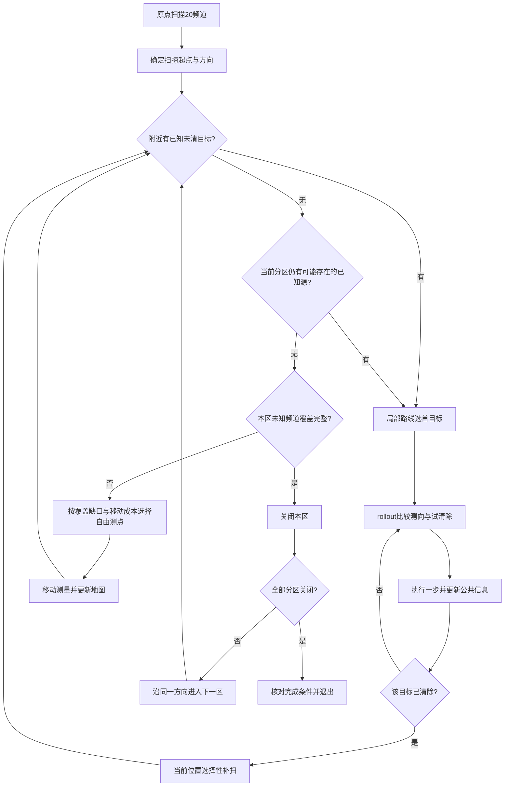

# 动态覆盖搜索、分区清空与局部期望时间决策

2026-09-12。本目录是当前改进版；上一级固定外环实现及历史数据保留作为对照。**所有本轮数据均为本地合成仿真，不是官方演练或正式测试；没有消耗任何正式次数，也没有连接官方演练。参数尚未训练优化。**

## 1. 本轮解决了什么

### 搜索点由未覆盖区域决定

不再预先生成半径1400m的圆。原点扫描20个频道后，按初始目标方向密度确定扫掠起点和顺/逆时针；把地图分成默认8个角向区域。区域只约束总体推进次序，测点半径是自由的。

对每个仍未发现的频道，保留接收半径下界1000m形成的覆盖证书。一个网格只有**整个方格**都在某次测量的1000m圆内，才标记已覆盖。靠近角向边界的方格同时计入两个邻区，避免按方格中心分区漏掉边界。

`Sweep.next_point()` 从自由平面候选网格、未覆盖格子位置、缺口加权中心及其向内缩点、当前位置中选择测点。评分为

\[
S(q)=\frac{\text{本区未知频道新增覆盖比例}+\lambda\,\mathbf 1[\text{本区剩余未知覆盖全部完成}]}{\|q-p\|/5+6\,n_{\rm scan}+1}.
\]

分母是前沿选择使用的移动和扫描成本近似，实际执行仍按题目切频、扫描、清除精确计时。每次移动后重新读取覆盖缺口，重新选点，不复用过时的下一站。极薄残余缺口可由缺口格子中心作为保底候选保证进展。

本轮demo的探索测点距原点约520–1610m，并非固定1400m。某些测点恰好是清除后的当前位置，新增测量不产生移动。

### 先清附近，再向下一片未知区域移动

全局方法为**带区域关闭约束的滚动时域路径规划**：

1. `clean_neighborhood()` 先处理包围圆中心距当前位置不超过 `nearby_distance=500m` 的已发现目标。半径大于60m、300m也不会因此被排除；不确定性大则调用局部定位策略。
2. 本分区仍可能存在的已发现目标由 `Sweep.outstanding()` 给出。目标多边形先与角向扇区精确相交，再结合 `no_signal`、非near等排除信息判断，不能仅用粗网格是否相交判断。
3. `short_service_route()` 对当前目标集做最小增量插入和2-opt改良，形成以候选下一测点为终点的开放路线；**只执行第一个目标**，清除、补扫、更新地图后再规划。
4. 任何一次未知区域迁移前，已知附近目标必须为空。本区已知待清目标也优先服务。
5. 只有“本区所有未知频道覆盖完整”且“本区没有仍可能存在的已知未清源”，才记录 `sector_closed` 并进入下一区。



这样避免把已知未清源留在已关闭分区、绕完再回来处理。几何不确定性和分区内径向目标分布仍可能带来局部回走；**不能由此证明每段行程都小于某个距离，或任意随机场景绝无长距离折返**。附近定义目前使用估计圆心距离；真实目标位置尚不确定时，“真实附近的每个源”无法提前保证已被发现。这里保证的是公共信息下的清空和覆盖条件，而不是读取真值后规划。

开发中曾发现：初始测向扇形都在原点附近相接，粗网格会错误地要求第一分区服务所有方向的源。已改为精确扇区裁剪，并用方向反馈意味着距离大于5m排除原点退化交集。新增回归测试保留这项更正。

## 2. 大于60m、20–60m究竟怎么选动作

### 旧函数的真实行为

上一级 `decisions.choose_clear_or_probe()`：

- ρ≤20：选择有几何保证的清除位置。
- 20<ρ≤60：若圆心命中率达到0.4、试清除预算未用完，则到圆心试清除；否则到圆心测向。
- ρ>60：到圆心测向。

因此旧版确实没有比较“斜前测向”和“直接接近测向”的总时间。20–60也不是无条件清除，但动作位置基本相同。

### 新函数：一步rollout + 公共反馈后重规划

`local_rollout.choose_action()` 对同一当前信念状态 \(b\) 比较：

- 直接去当前最小包围圆圆心测向；
- 朝圆心前进0.5或0.8倍距离，再左右侧移，侧移上限默认70m且不超过接近距离的30%；
- 圆心试清除、后验样本估计的高命中质量位置试清除；不再以60m为硬门槛。

\[
\widehat Q(b,a)=t_{\rm move}(a)+\frac1M\sum_{j=1}^{M}
\left[t_{\rm action}(a,o_j)+V_{\pi_0}(b'_j,p_a)\right].
\]

\(\pi_0\) 是后续“到包围圆圆心测向，缩小到r20后保证清除”的基策略。每个候选都计入移动、切频、扫描、成功清除5秒、miss 3秒，以及后续动作。只执行估计最省时的第一步，真实反馈到来后重新计算，形成自适应决策树。

用概率展开，清除候选为

\[
Q_{\rm clear}(q)=\|q-p\|/5+5p_{\rm hit}(q)
+[1-p_{\rm hit}(q)]\{3+E[V_{\pi_0}(b_{\rm miss},q)]\},
\]

测向候选为

\[
Q_{\rm measure}(q)=\|q-p\|/5+5+\mathbf1[c\ne c_{\rm current}]
+E[V_{\pi_0}(b_o,q)].
\]

代码用样本直接平均上述分支成本；清除不会改变当前测量频道，因此失败后若需测向仍计切频成本。基策略在miss后保留保守凸外包，这低估了排除圆可用于改进后续行动的价值，当前属于保守续策近似。真实执行的miss会更新完整排除记录和粒子权重。

默认每次使用12个分层抽样的公共后验情景；同一组位置、接收半径和测角误差用于全部候选，减少比较噪声。后验来自公开测向多边形、近距反馈、正负接收约束及miss排除；不读取模拟器真实源坐标。接收半径按每个位置样本的可行区间抽样。测角误差使用本地均匀误差假设，并非宣称题目保证了某个精确贝叶斯概率模型。

若相对直接测向的估计收益不足1秒，保留直接测向；没有有效粒子时也退回保守测向。ρ≤20使用几何保证清除，不必算rollout。

**所以，ρ>60可能斜前、可能直接接近，甚至可能试清除；20<ρ≤60同样比较，绝不是无条件去测。** ρ只描述外包尺度；当前距离、候选区形状、后验质量集中位置和失败后的代价共同决定动作。

demo（种子20260911）中的实际决策日志：

|频道与当时ρ|直接圆心测向预计总剩余时间|选中动作预计总剩余时间|选择|
|---|---:|---:|---|
|9，750.3m|247.4s|216.8s|斜前0.5倍、正侧移|
|16，483.2m|166.1s|166.1s|直接圆心测向|
|1，41.0m|93.0s|88.6s|高后验质量位置试清除|

这些是**执行前的有限样本估计**，不等于该次真实剩余时间或严格最优值。所有候选、估计标准误、命中率、选择理由都保存于 `decisions.json`，回放滑块到相应动作时可直接查看。

### 三次上限的含义

`rollout_probe_limit=3` 表示一个目标连续服务中，前三次补测允许考虑斜前候选，之后只保留直接圆心测向及可行试清除。它限制在线决策分支数，**不是“任意三次试探必定r20”的新定理**。ρ仍大于20时继续安全测向；服务最多16个动作后若仍未完成会明确报错，绝不把未清除当作成功。

## 3. 函数与后续优化参数

|文件 / 函数|职责|主要可调参数|
|---|---|---|
|`runner.Planner.plan`|原点扫描、分区推进、清空条件、动态重规划|`sector_count`|
|`frontier.Sweep.next_point`|基于逐频道覆盖缺口选择下一搜索点|`frontier_spacing`, `frontier_closure_bonus`|
|`frontier.Sweep.target_in_region`|精确扇区裁剪与保守可行性判断|几何安全规则，不当作自由优化门槛|
|`frontier.possible_cells`|多边形与方格SAT相交及排除圆过滤|`coverage_cell`影响证书保守度|
|`runner.Planner.clean_neighborhood`|离开未知区域前清空附近已知目标|`nearby_distance`|
|`frontier.short_service_route`|最小增量插入+2-opt局部开放路线|当前无额外路线参数；实时重算|
|`runner.Planner.scan_here`|已有测点选择性补扫已知、未知频道|`max_known_scans`, `known_score_min`, `rear_scan_weight`, `unknown_gain_min`|
|`local_rollout.posterior_scenarios`|从公共信念生成比较用情景|`rollout_samples`, `model_seed`|
|`local_rollout.choose_action`|比较完整预期剩余耗时，输出第一步|`probe_lateral`, `probe_fraction_near/far`, `action_margin_s`, `rollout_probe_limit`, `max_speculative_clears`|
|`local_rollout.continuation`|模拟安全基策略的后续耗时|基策略结构可改进|
|上一级 `Planner.execute` / `HTTPClient.command`|协议命令、日志、反馈更新、精确计时|与策略计算分离|

编辑本目录 `default_parameters.json` 即可调整现有决策逻辑。`search_space.json` 给出后续参数优化范围和目标建议；本轮没有启动参数训练。

优化器可调用 `evaluate.evaluate_parameters(params, seeds)`，返回 `(score, rows)`：全部完成时score是每局T/N的均值；出现未完成局则返回 `1e6+1e5×失败局数`，避免“少清除所以用时少”的错误优化方向。该函数只连接本地合成环境，不会开启官方测试。

为兼容公共世界模型，`DynamicParameters` 继承旧参数类，所以完整summary/map中仍会出现 `ring_radius`、`ring_nodes`、`initial_step`、`initial_lateral`、`service_radius`、`probe_service_radius`、`probe_detour_max`、`trial_probability_min`、`max_detour`、`route_detour_budget`、`route_batch`、`cleanup_weight`。**动态版不使用这些旧决策参数；调它们不会改变本版路线。** 本目录默认参数文件只列出当前有效的常用参数。

## 4. 本地验证结果

固定参数，同一100个种子20263000–20263099，与上一级保存的固定环结果逐场配对。该批用于版本回归比较，尚不是参数训练后的独立泛化结论。

|指标|固定外环|本动态版|
|---|---:|---:|
|完成场景|100/100|100/100|
|清除源总数|1297/1297|1297/1297|
|每场T/N再取均值|429.27s/源|279.28s/源|
|平均移动路程|23.32km|12.86km|
|平均扫描次数|128.21|154.78|
|miss总数|131|179|

平均每源耗时减少149.99秒，约34.94%；配对差值标准误5.29秒；100场全部快于旧版。平均路程减少约44.85%。更积极的试清除增加了miss，同时减少移动总成本；优化目标是总完成时间，不能把miss单独当成总性能指标。

100场内的局部实际动作统计（ρ为执行前状态；同一目标可贡献多个动作）：

|范围|直接测向|斜前测向|试清除|
|---|---:|---:|---:|
|20<ρ≤60|113|25|705|
|ρ>60|71|750|98|

所有未知区域迁移之前的已知附近未清目标计数均为0。单场平均本地计算墙钟时间首次约2.95秒、最终复核约2.70秒，与同时运行的进程和机器有关。

用户此前demo相同种子20260911：311.83→229.22s/源，20.79→13.93km，16/16，miss 2→0。用“连续两段都超过600m且转向超过120°”诊断明显折返，5→0；这是明确口径的单场诊断，不是任意场景无折返定理。

完整100场结果见 `outputs/paired_v2/summary.json`、`cases.json`；其中前3场有全量命令和决策记录。最终代码又对同100场复核，结果保存于 `outputs/final_validation`，每场移动路程、虚拟时间、动作次数、清除结果与首次配对验证完全一致。`outputs/final_demo/replay.html` 是最终代码生成的演示，`outputs/demo`与其轨迹及虚拟时间相同。开发初版 `outputs/benchmark` 只保存被中断试跑的部分轨迹，不作为当前100场结果使用。

## 5. 复现与接口

在仓库根目录运行；Windows本机Python可用 `D:/ProgramData/anaconda3/python.exe` 替代下列 `python`。

```powershell
python -m question3.global_policy.dynamic.runner --seed 20260911 --params question3/global_policy/dynamic/default_parameters.json
python -m question3.global_policy.replay --input question3/global_policy/dynamic/outputs/demo
python -m question3.global_policy.dynamic.compare_demo
python -m question3.global_policy.dynamic.evaluate --count 100
python -m unittest question3.global_policy.dynamic.test_dynamic question3.global_policy.test_policy question3.local_sim.test_local question3.local_sim.three_probe.test_certificate
python -m question3.global_policy.dynamic.check_http
```

`check_http` 自行开启随机空闲端口的本地合成模拟器，退出后关闭。仍使用 `/enter`、`/measure`、`/clear`、`/exit` 四个原题命令，保留 `arena_id/robot_id/request_id/position/channel` 及原响应结构；策略层只依赖 `command(path,position,channel)`。

46项相关测试全部通过，其中新增11项，包含圆周边界布局、重合源、密集远端源、角区边界网格、原点退化交集、半径分支、失败局惩罚和公共接口隔离。接口已本地HTTP跑通，种子20261209，12/12源，294.39s/源。CLI保留与旧版一致的演练接入显式标志，但**此次没有连接官方模拟器**。以后需要用户明确开始演练并核实官方界面模式，客户端本身不能从端口号证明官方服务正在演练。没有正式测试入口。

## 6. 论文中如何表述

可以称为：**基于逐频道覆盖前沿的分区扫掠与滚动路径规划，以及信念空间的样本rollout局部决策**。

前沿搜索思想参考 [Yamauchi, A Frontier-Based Approach for Autonomous Exploration](https://www.cs.cmu.edu/~motionplanning/papers/sbp_papers/integrated2/yamauchi_frontier_explor.pdf)；该文讨论自主探索，本项目把前沿改造成逐频道接收覆盖缺口，并增加区域清空证书，不能把本项目规则说成原论文结论。

局部动作的“先行动一步，随后用基策略估计代价”参考 [MIT Dynamic Programming and Stochastic Control, Lecture 19](https://ocw.mit.edu/courses/6-231-dynamic-programming-and-stochastic-control-fall-2015/resources/mit6_231f15_lec19/)。这里实现的是有限候选、有限情景、滚动执行的近似策略改进。论文应如实写明候选集合和样本平均近似，**不应宣称已经求得任意走法、完整连续决策树的全局最优解**。目前尚未联合计入本次服务结束位置对全部其他源的精确价值，该项由上层滚动路线近似处理。

后续可将策略参数写成 \(\theta\)，用固定训练种子的样本平均目标 \(\min_\theta N^{-1}\sum_i T_i(\theta)/n_i\) 做差分进化或其他无导数优化，失败局施加大惩罚；另外留独立种子验证。策略的在线rollout与离线参数搜索是两层不同优化，不能混为“全局最优”。
