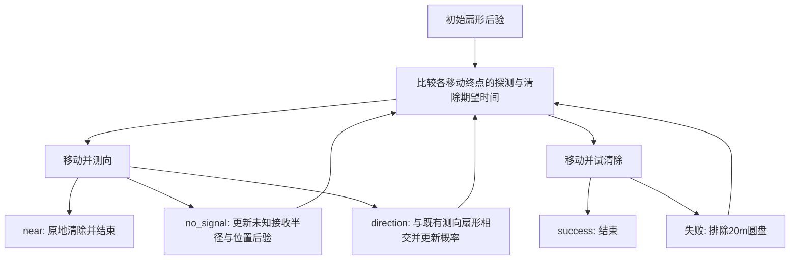

# 第三问：本地仿真与单目标探测—清除决策树

本方案包含可运行的随机多源环境、与附件一致的正常策略命令接口，以及一个独立的单目标期望时间数值优化实验。所有新增成绩都是**本地合成结果**，未运行新的官方演练或正式测试。

## 1. 已实现的环境

`simulator.py` 生成 N 个全向源：N 从10–16的整数均匀抽样，频道从1–20无放回抽取，位置在半径1800m圆盘内面积均匀，每个接收半径独立均匀取1000–1500m。位置采样必须使用 `r=1800*sqrt(U)`，直接让r均匀会使单位面积密度向中心集中。

| 规则 | 实现 |
|---|---|
| 初始位置、频道 | (0,0)、1 |
| 检测 | 移动距离/5 + 5秒 + 必要时切频1秒 |
| 有信号 | 到该源距离≤该源接收半径 |
| near | 距离≤5m，无示向度 |
| 示向度 | 真方位+[-1°,1°]误差，保留两位小数，归一化到[0,360) |
| 同位置重测 | 同源、同坐标误差固定 |
| 清除 | 距离≤20m成功；成功5秒，失败3秒，另加移动时间 |
| 清除频道 | 只指定目标，不改变测向频道，不收切频费 |
| 退出 | 任意位置退出，零虚拟耗时 |
| 地图边界 | 允许机器狗出界，坐标各分量必须有限且绝对值≤2000000 |
| 时间 | 微秒累计；360000秒虚拟上限、进入后最多1200秒现实时间 |

**分布假设与题目事实分开：**官方只给数量、接收半径、误差的范围，没有承诺均匀分布或不同位置误差独立。本地采用均匀分布和按位置哈希固定的误差场，方便可重复实验，不是复刻官方随机生成器。

接口支持 `/enter`、`/measure`、`/clear`、`/exit`，请求字段、成功响应字段、结果码、动作计时与附件对齐。支持请求幂等、冲突409、主要400/404/415校验、未知字段拒绝；策略接口不暴露源数、坐标、半径或真值。`truth.json` 是评估端文件。

本地服务器不是官方网络服务器的完整克隆：没有登录、倒计时UI、加密日志上传、流量保护、完整并发冲突与全部畸形JSON防护；结束后会返回拒绝而非关闭监听端口。一个服务器进程对应一局，下一局重新启动。正常串行策略命令已通过真实HTTP联调。

## 2. 运行方法与后续策略接口

在项目根目录运行，Python需安装NumPy；当前验证解释器为 `D:/ProgramData/anaconda3/python.exe`。

```powershell
# 终端1：一局本地随机环境，端口避开官方的2026
python -m question3.local_sim.simulator --seed 20260911 --port 2027 --robot-id local

# 终端2：原有策略不改代码，只换地址
python question3/robot.py --robot-id local --base-url http://127.0.0.1:2027 --log-dir question3/local_sim/outputs/manual_robot

# 单目标数值优化+三组配对策略评价，输出到独立目录
python -m question3.local_sim.solve_single --episodes 300
python -m question3.local_sim.export_plan

# 物理、协议、贝叶斯分支和覆盖验证
python -m unittest question3.local_sim.test_local -v
python -m question3.local_sim.check_http
```

后续策略统一输出 `(path, position, channel)`，通过相同客户端执行：

```python
from question3.local_sim.simulator import Client

client = Client(robot_id="local", base_url="http://127.0.0.1:2027")
client.command("/enter")
observation = client.command("/measure", (530, -80), 1)
result = client.command("/clear", (800, 0), 1)
client.command("/exit")
```

切到官方环境只需改 `robot_id` 和 `base_url`。正式策略可沿用 `robot.py` 已有的网络重试封装：同一动作重试必须复用request_id，新动作才生成新ID。本方案轻量 `Client.command` 不自动处理网络重试。

本地内存调用可传 `Client(simulator=Simulator(seed))`，请求和返回JSON相同。策略必须只使用命令响应；仿真对象和真值只供评估端使用。

## 3. 单目标场景的严格定义

把用户的“远点”理解为原点。原点已经得到0°示向度，半顶角1°。先抽隐藏接收半径

\[
R\sim U(1000,1500),\quad \Phi\sim U(-1^\circ,1^\circ),\quad
D=R\sqrt U,\quad G=(D\cos\Phi,D\sin\Phi).
\]

然后条件化到 `D>5`，对应已收到 `direction` 而非 `near`；代码对联合样本拒绝D≤5，因此条件化后的R分布有极微小变化。时间从已有初次示向度后计算，不含获得它之前的搜索与检测开销；若从第一次原点检测开始计时，加5秒。

**1000–1500m是随机扇形半径，不是目标距离的下界。**目标也可能位于100m处。因此走过目标后再回头的分支必须计入，不能只考虑“继续前进”。

该分层先验是用户指定的局部实验模型，不等于“全图均匀源恰好被原点发现”的条件分布。后者应从全图先验按发现事件进行贝叶斯更新，R的权重也会改变。不能直接拿本局部策略统计当第三问全图平均成绩。

## 4. 为什么要同时优化探测与试清除

状态用当前位置s和隐藏变量(G,R)的后验b表示。源坐标固定；R也必须保留，才能正确利用no_signal。完整状态还需当前检测频道和同点观测记录；本单目标实例频道固定为1，已经访问过的测点禁止重复作为探测候选。

令q为下一个动作位置，`b_z`为收到反馈z后的后验，则理想贝尔曼方程为

\[
V(b,s)=\min\{\inf_q Q_m(b,s,q),\inf_q Q_c(b,s,q)\}.
\]

\[
Q_m=\frac{\|q-s\|}{5}+5+\mathbb E_{Z\mid b,q}[V(b_Z,q)].
\]

多源时，测量动作还应加上是否切换频道的1秒。单目标场景没有该额外项。

令p为20m圆盘内的后验概率，失败后 `b_f ∝ b 1{||G-q||>20}`，则

\[
Q_c=\frac{\|q-s\|}{5}+5p+(1-p)[3+V(b_f,q)]
=\frac{\|q-s\|}{5}+3+2p+(1-p)V(b_f,q).
\]

**不要求p=1才清除。**只要Qc比进一步测向的Qm小，带失败概率的试清除仍然更快。失败不只是浪费3秒，它同时排除了一个圆盘。反过来，不能只最小化定位区域面积、半径或单次失败率，因为这些都没有完整计算移动时间。

各观测的后验更新：

- `near`：距离≤5m，下一步原地clear，必成功，再花5秒。
- `no_signal`：目标仍存在，保留满足 `||G-q||>R` 的假设。
- `direction=z`：保留接收范围内且距离>5m的假设，按±1°误差与读数舍入区间的重叠长度赋权。两位小数舍入使严格几何角界成为约±1.005°，不能简单当作±1°硬切割。
- `no_target_in_range`：排除以q为圆心、20m半径的圆盘，再重算探测与试清除的时间。
- 同位置重复测向的误差固定，不能作为独立样本叠乘似然。



## 5. 脚本怎样近似求解

1. 用4096个联合粒子表示(G,R)后验，规划时用确定性分位抽样压缩成96个等质量样本。
2. 候选测点包含前进、左右斜前、到后验中心；候选清除点包含中心、中心朝当前位置退15m及若干后验分位代表点。每次移动是一条直线，多次动作形成折线。
3. 初次测点在前进比例0.2/0.35/0.5/0.65/0.8/1.0及侧向0/15/40/80/160m的网格中比较。左右都考虑，有限样本选负侧不代表物理上负侧更优。
4. 规划时对示向度按4°分箱，用区间似然积分计算全部非零分支，另有near和no_signal；不是把真实测量噪声改成4°。
5. 默认向前展开一层，末端用覆盖所有剩余粒子的清除巡回时间作为价值近似。巡回分别沿x正序、逆序清除支持点，并跳过已被20m圆盘覆盖的粒子，取较小期望值。该策略只对离散粒子分布可行，不能视为连续分布的严格上界。
6. 收到实际0.01°读数后，更新完整粒子后验，再滚动重规划。`--depth 2`可展开更深的树，但计算量明显增加。
7. `export_plan.py` 将第一步所有非零观测分支逐一重新规划，保存第二动作及其反馈分支；这是一层滚动规划的解释展开，不冒充联合优化的无限深树。实际细读数可能给出不同于粗分箱表的动作。
8. 粒子耗尽时从原始先验按公开观测历史重新筛样；无法恢复或20轮尚未成功时，在初始扇形外接矩形上执行25m网格清除。网格覆盖连续扇形，最大最近网格距离≤17.68m<20m，不依赖粒子是否包含真值。

**最优性的范围：**求得的是有限候选动作、粒子后验、分箱观测及有限深度末端近似下的较优动作，不是任意连续走法的全局最优。没有声称已求完全部无限分支。末端策略、粒子分辨率与候选网格都会影响数值。

## 6. 实际执行结果

默认种子20260911，第一步选 `measure (530.2324,-79.3702)` m，斜向角约−8.51°，路程536.14m，移动约107.23秒，再测向5秒。第一层离散树的剩余时间估计为210.17秒；这是模型估计，不是实验均值。

验证种子20261911–20262210，共300个独立目标/误差场，三策略使用相同目标和相同误差场。初次决策优化所用粒子与验证目标分开；每局内部后验粒子也不包含真值。

| 策略 | 平均剩余时间/s | 均值标准误/s | P90/s | 平均测向次数 | 平均clear次数 | 成功 |
|---|---:|---:|---:|---:|---:|---:|
| 斜前首步+滚动树 | 201.03 | 2.80 | 267.23 | 1.77 | 1.37 | 300/300 |
| 同x首步、y=0+同一滚动树 | 202.97 | 2.81 | 271.52 | 2.37 | 1.27 | 300/300 |
| 向后验中心前进70%，粒子覆盖概率≥0.999才试清除 | 224.42 | 2.78 | 285.60 | 3.70 | 1.10 | 300/300 |

斜前减去直走的配对时间差为−1.943秒，标准误0.563秒，近似95%区间为[-3.05,-0.84]秒。比较的是**相同前进距离的直走首步**，不是所有直走策略中最优者。第三行是已实现的保守启发式，并非精确的“保证定位后清除”算法。

900局全部成功，均未启动网格兜底；不代表所有随机场景都不需兜底。总运行约28.52秒，详情见 `outputs/single/summary.json` 和 `episodes.json`。

分辨率审计（8192个后验粒子，分别压缩到96/192/384）：首点约为(394,80)、(551,80)、(530,160)m，见 `sensitivity.json`。**斜前思路在这些配置下被选中，但最优坐标尚未收敛；不能把(530,-79)作为固定最优常数。**这组审计没有追加独立成绩比较，不能用其估计值替代上表。

验证：13项单元测试通过，包含附件计时示例105/111/194/199秒、距离边界、幂等、拒绝不计时、固定误差、分支概率和连续网格覆盖采样。完整HTTP联调使原有 `robot.py` 在本地seed20260911下清除16/16，总时间6015.760433秒、231条命令；是旧策略的新本地兼容性验证，不是新策略的官方成绩。

## 7. 输出与接入第三问全图的边界

- `outputs/single/decision_tree.html`：可点击展开的两步分支表。
- `outputs/single/tree.json`：初次全部候选动作、价值和反馈分支。
- `outputs/single/expanded_tree.json` / `branches.csv`：29个非零首步分支及下一步动作。
- `outputs/single/episodes.json`：全部900条实验轨迹、真值和命令；真值仅用于离线复核。
- `outputs/http_smoke/`：真实HTTP联调的真值、命令、旧机器人日志。

本次完成多源环境和单目标子问题。全图任务还必须维护每个频道的未知/已发现/已清除状态，安排全域探测覆盖、频道切换与目标间移动，才能确保全部10–16源清除。不能在清除已发现的源后直接退出，因为源总数未知。新局部决策树尚未替换旧机器人的全局调度；旧策略文件保持原状。
