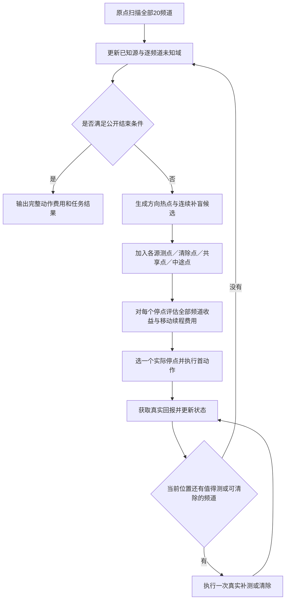

# 第四问：动态未知域与多源监测点联合规划

本方案响应“移动选点之前考虑其他源的定位收益、每个实际停点重新选择频道”的要求。入口为 `question4.dynamic_joint.planner.Planner`，物理接口仍为 `command(kind, position, channel)`。第三问和第四问旧 `full_mission` 的执行代码均不修改。

## 相对旧联合方案的修改

旧联合方案先把固定搜索站和已知源中心排成开放路线，再对排到前面的源生成服务测点。新方案先生成所有任务的实际候选停点，评估在同一停点测量多个频道的价值，再选一次移动与首个动作。内外圈和锯齿顺序不再是执行模板。

| 层次 | 新实现 | 函数 |
|---|---|---|
| 未知频道 | 每个频道独立保留位置×发射朝向残余状态以及真实负反馈位置 | `DirectionalCoverage.observe` |
| 探索测点 | 残余方向热点、未知域重心偏移、当前几何缺口产生坐标 | `candidate_points`、`completion_plan` |
| 已知频道 | 用位置条件的朝向/半径相容状态预测命中概率和测向后的定位半径 | `measurement_value` |
| 多源共点 | 每个停点评估全部活跃源；补充源对共享点、长路段中途点及坐标细化 | `_raw_candidates`、`_evaluate`、`choose` |
| 到点扫频 | 每条真实回报后重算已知/未知频道收益，决定补测、清除或离开 | `assess_stop` |
| 完整性 | 未知域离散网格只负责引导；无源结论使用该频道真实扫描的连续覆盖证明 | `channel_certified` |

## 1. 未知域维护的是位置和方向的相容关系

对于未知频道 `c`，规划网格中每个位置 `g` 配有24个半平面法向 `n`。在位置 `q` 收到该频道的 `no_signal` 后，只删除同时满足以下条件的状态：

\[
\|q-g\|\le1000,\qquad n\cdot(q-g)\ge0.
\]

这些状态按照题设最小接收半径必然有信号，因此与负反馈矛盾。位于相反发射半平面的状态仍然保留，不能像第三问那样删除整个1000米圆。不同频道扫描历史不同，就有不同的未知域。这里不是给每个未知源猜一个确定指向角。

对于已发现源，保守位置多边形以及位置条件的角度区间、相容接收半径段沿用已核验的定向模型。预测接收时对联合相容质量积分，不能先算一个平均命中率，再用不考虑接收条件的位置样本估计定位效果。

连续无遗漏依据是：若区域内任意可能源位置 `g` 都落在一组已测点的凸包里，而且对应三角形各边短于1000米，那么这些顶点距离 `g` 均不超过最小接收半径。对任意发射半平面，必有一个顶点位于发射侧，因此该频道不可能在所有这些点都返回无信号。证书逐频道核对真实扫描点；只在别的频道测过同一个坐标不算证据。

## 2. 实际候选停点从哪里来

每轮合并以下坐标，并由一个评分函数共同筛选：

1. 未知域中剩余位置和方向质量较大的区域，沿尚未被探测的发射方向生成接收点。
2. 由已扫描坐标形成的凸包边界缺口、长边三角形缺口生成补盲点。
3. 各已知源的侧向测点、靠近测点、中心附近点和清除点。
4. 能同时形成较好交会角的多源共享点。
5. 长移动候选线段中的45%、70%位置，作为需要真实停下测量的候选。
6. 最优普通测点附近四个方向的坐标细化。

候选中途点不会因“在路上”自动被访问，必须在联合评分中胜出。实际移动段本身不提供任何测量信息。几何补全也不是强制路线：实际扫频支持允许删去未来节点，每积累若干共同实际停点还会尝试重新生成更短的合法补网。

**保留的构造先验：** 为了有可执行的全图补盲续策，几何模块在边界未被实际点包围时会生成一个外包12边形支持池，并细分长边三角形。初始对称状态下它可能表现为类似内外两层的坐标。它是候选和连续保证的构造先验，不能声称完全无几何先验；实际执行顺序和普通探索点没有固定圆周/顶点要求。若自适应几何构造失败，才使用已证明的有限锯齿覆盖构造，日志明确记录 fallback。

## 3. 一个停点的联合评分

对已知源 `c`，以保守最小包围圆半径 `rho` 定义定位剩余工作量近似：

\[
\Phi_c=0.30\max(\rho_c-19.8,0)\quad\text{秒}.
\]

通过位置条件接收概率、3个接收条件位置分位点和3个误差分位点评估测量后的 `E[Phi_c']`，得到 `V_c=Phi_c-E[Phi_c']`。无信号分支保留位置外包多边形，其真实负观测仍会更新后续接收概率。

未知频道用该点能排除的初始位置×方向质量，分摊预计剩余搜索工作量，得到一个覆盖收益近似；对单停点的总收益设置上限，防止只剩少量离散状态时高估远处点的收益。它不是经过校准的“发现真实源概率”。

候选停点评分包含：

\[
J(q,A)=T_{move}+T_{scan}+T_{clear}
+w_{route}\widehat T_{future\ route}
+\widehat T_{future\ clear}+\sum_c\Phi_c
-\sum_{c\in A}V_c-V_{unknown}+P_{revisit}.
\]

移动时间只计一次，实际测量和切频按所选频道顺序计费。其他源的收益直接进入移动前的 `J`，因此可以改变目标坐标，而不只是到达后顺便测量。未来路线包含剩余已知源位置和连续补盲支持；候选点替代未来支持时也必须通过连续几何检查，不能因为粗网格上收益为零就删掉仍必需的节点。

该公式是有限候选、有限样本和启发式续策评分，不是精确的总时间期望。定位半径转秒数、未知收益上限和未来路线权重均需用完整任务的开发数据校验。

## 4. 每一步实际执行

原点先扫描20个频道。之后每轮执行：

1. 用已经收到的全部真实回报更新位置、接收状态和逐频道未知域。
2. 生成/更新一条具有连续覆盖证明的未来补盲计划，用于续程估算和必要时完成搜索。
3. 合并所有实际停点候选，评估各点的已知源定位收益、未知域收益和费用。
4. 选择评分最低的一个停点以及首个测量/清除动作，只执行这一步。
5. 收到回报后，在当前位置重新计算各频道价值；值得测才测，满足保守清除条件则实际清除；每次回报后再算一次。
6. 当前没有值得执行的动作后，重新进行全局选点。记录真实停点、频道、费用、候选评分及跳过的测量。
7. 已发现16源时停止额外未知搜索，但仍清除全部已知源；否则必须逐频道完成连续无源证明且清除全部已发现源后才结束。

所有已知频道的无线测量入口共享恢复门槛：连续定位停滞达到8次、已发现后的无线测量达到12次、失败清除达到8次或已启动有限光学覆盖时，禁止继续用共享点、坐标细化或停点补测为它新增无线动作，只保留清除恢复通道。这样多源联合选点不会绕过单源有限恢复机制。



## 5. 已确认的实现边界

未知方向网格不是严格概率后验，不能用其清空声明无源；已知源的离散积分也不能证明源不存在。未接收分支对朝向约束的长期信息价值尚未直接换算为秒数。有限光学清除沿用旧方案；运行预算耗尽会报告未完成，绝不以提前终止取得较短成绩。所有目前实验均为本地合成，未使用官方演练或正式测试。

实验已完成：最终100个新共同场景每策略均1234源全清，新方案524.37、旧方案534.57完整秒/源。结果、失败修复记录、可复现命令与局限保存于[RESULTS.md](RESULTS.md)和[AI_INTERACTION.md](AI_INTERACTION.md)，旧冻结基准不覆盖。

## 使用冻结设置

`Parameters()` 是开发缺省值；本轮开发选择的设置为未知收益上限60秒、续程权重1，完整配置保存在 `outputs/frozen_parameters.json`。实际接入相容命令函数时应显式加载该配置：

```python
import json
from pathlib import Path
from question4.dynamic_joint.planner import Parameters, Planner

config = json.loads(Path("question4/dynamic_joint/outputs/frozen_parameters.json").read_text(encoding="utf-8"))
params = Parameters(**config["configs"]["dynamic_joint"]["parameters"])
policy = Planner(command, params, record=True)
result = policy.run()
```

`command` 只传入公开测量/清除接口，不传入模拟器对象、真实源位置或真实源数。这里展示接口用法，不会自动连接官方服务。

用新的输出目录进行一场本地复现，避免覆盖已保存的100场验证：

```powershell
.\.venv\Scripts\python.exe -X utf8 -m question4.dynamic_joint.evaluate --stage smoke --variants question4/dynamic_joint/outputs/frozen_parameters.json --seed-start 20287000 --count 1 --workers 2 --output question4/dynamic_joint/outputs/new_smoke
```
