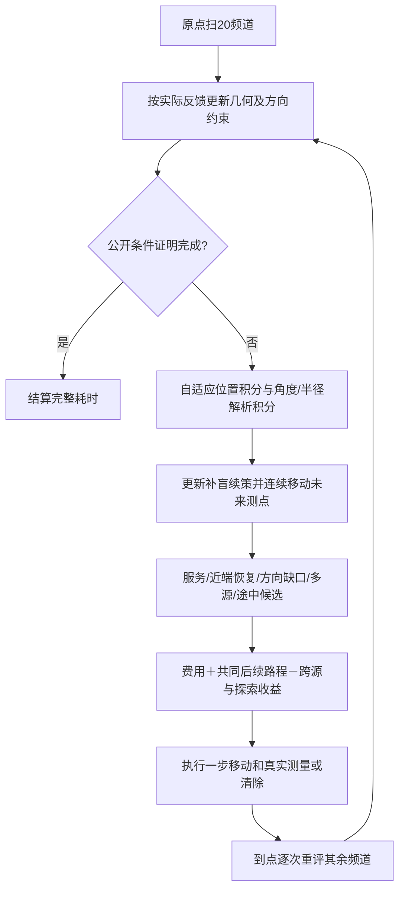

# 第四问自由补点与定向接收恢复（已完成独立验证）

本轮目标是完整平均时间低于500秒/源。总时间包括移动、所有测量、切频、成功和失败清除，以及最后确认剩余频道无源的补盲。已完成本地独立100场验证：483.34秒/源，1307源全清。详细统计与坏案例见[RESULTS.md](RESULTS.md)。

## 为什么不能只把外圈点加密

上一版方向域虽已动态更新，但主移动仍由几何补全候选支配。更关键的是，一次正示向度产生的长窄位置多边形，用32个面积积分点常常无法分辨近端的小块相容位置。失联后有时只有一个有效积分点，接收概率会显得过度确定，随后绕到远端、继续失联，最终触发长光学补查。

旧坏例20288085频道13在动作268后的条件积分，有效位置数为1；新积分在同一段公开历史下自动增加至2048个位置点，有效样本数44.23。这是数值诊断，不是完整任务提速成绩。

## 实现流程

1. 原点扫描全部20个频道。正反馈收缩保守位置多边形，负反馈更新位置条件下的朝向和半径约束，并更新未知频道方向缺口。不会把定向源的失联当成1000米位置排除圆。
2. 为每个已知源重新计算条件分布。位置从128点开始积分；有效样本数不足24时增加至512、2048点。对于每个位置，朝向按所有正负观测切成角度段，段内半径上下界解析积分。概率只用于选点，不用于证明无源。
3. 生成具有连续覆盖保证的未来补盲方案。初始仍使用几何构造作可行初值；随真实历史删去冗余点，并对近期未来点连续调整坐标，吸引方向包括当前位置、相邻未来点和已知源中心。只有共同剩余路程下降且所有相关频道仍有连续覆盖保证才接受移动。没有必须到达的预设正六边形顶点。
4. 生成服务、方向缺口、多源共享和途中停测候选；加入相对最近正反馈点的近端斜向探测。短步长度由当前几何缩放，左右两侧都比较，避免只有长程向位置中心推进的选项。
5. 每个候选计算真实移动与动作费用、跨源定位收益、未知方向收益及后续共同路程。只执行评分最低的一步。对于需要维持连续补盲方案的停点，测量对应频道。
6. 到点后按每条新反馈重新判断其他频道是否值得测量，并立即执行有保证的同点清除。更积极的未知侧扫作为开发消融比较，不能因为移动已经发生就忽略测量费用。
7. 无线恢复预算统一约束所有全局、共享、细化和到点补测入口；预算耗尽后进入有限光学覆盖。实际清除由真实反馈确认。
8. 清除公开上限16个源，或全部已知源清除且剩余频道获得真实连续无源证书，才结束。

## 保证和近似的边界

连续覆盖仍使用实际负反馈点组成的短边三角网充分证书。调整未来点只改变计划，不能把未来测量当成已发生的证据。`proof.py`保存了另一种局部凸包分区证书实验，当前不接入执行，因为细分开销较大。

自由补点仍有初始几何构造作为路线初值，并非宣称完全没有先验；区别在于坐标可以随任务状态改变。服务价值和未来路程都是有限候选滚动启发式，不是全局最优保证。必须用新的共同场景检查完整均值和全清率。

## 当前冻结设置与未采用的消融

已选自适应128–2048位置积分、近端测点、可移动覆盖支持，移动覆盖信用总上限60秒，续策权重1，保持已有停点测量净收益门槛2秒。未知侧扫额外放宽关闭；条件后验作为服务路由点、清除可行域边缘候选均作为实验开关保留，但此次冻结不启用。参数全部展开保存在outputs/frozen_parameters.json。

16场开发最佳503.3255秒/源，尚不能凭开发成绩宣布达到500目标。预先指定的全新100场20293000–20293099已验证完成，483.3372秒/源，全清。

## 入口与文件

- `planner.py`：滚动选点、近端候选及实验开关；默认值已同步到开发最佳组。
- `belief.py`：已发现源的条件位置、朝向和半径积分；未知频道由独立方向覆盖图维护。
- `coverage.py`：真实历史下的连续可移动补盲续策。
- `evaluate.py`：完整任务配对运行、冻结设置和实际回放。
- `outputs/develop1`、`outputs/develop2`：所有开发组结果和执行源码快照。
- `outputs/regression`：明确标记的历史难例回归，不作为独立验证样本。

最终验证口径和结果以RESULTS.md及outputs/validate.json为准，算法保证只涉及真实几何约束和连续覆盖，预期费用不是精确全局最优解。

运行依赖已隔离至frozen_dynamic目录，避免另一个任务修改共用规划器时改变本方案。原300任务冻结检查异常和全部100场隔离重跑逐动作一致性证据保存在outputs；重复运行不是额外独立样本。
