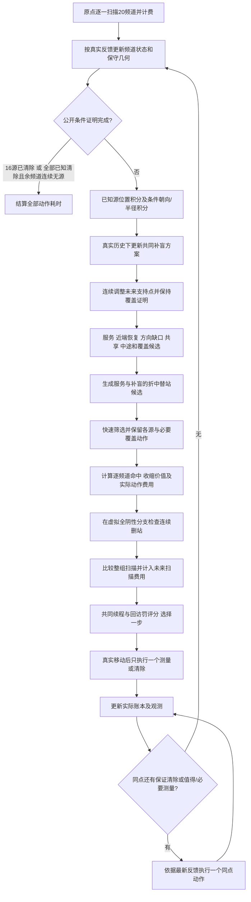
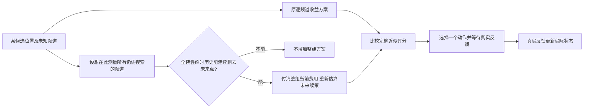

# 第四问：动态联合测点、成组补盲与参数选择

**本轮正式选定并冻结`trial_031`，独立100场完整均值481.3999秒/源、1303源全部清除。** 运行配置见[best_config.json](best_config.json)，完整参数见[best_parameters.json](best_parameters.json)。算法采用动态共同测点、位置条件朝向/半径积分、可移动连续覆盖支持、近端接收恢复、未来扫描计价、成组扫频和服务/补盲折中替站。33组贝叶斯训练与7组32场选择均已完成；训练最低为027，最终按32场选择最低采用031。

本文按 `tuned_joint/planner.py`、其继承的 `free_joint` 以及隔离的 `frozen_dynamic` 代码说明实际采用算法。原483.34秒/源版本的参数事实与历史试验见 [PARAMETER_AUDIT.md](../free_joint/PARAMETER_AUDIT.md)。同新100场最初joint494.0876、上一free482.9419、本轮481.3999秒/源；相对最初的配对改善有统计支持，相对上一free只低1.5420秒/源且配对95%区间跨0，**不能声称稳定胜过上一版**。完整证据和限制见[RESULTS.md](RESULTS.md)。

## 1. 任务、指标与总体方案

机器人从原点出发，在20个频道中搜索并清除10–16个干扰源。每源位置在半径1800 m圆盘内，接收距离固定在1000–1500 m之间；发射可为全向或朝向未知的固定180°半平面。同频道、同精确位置的测角误差固定，因此同点重复测量不能靠平均消除误差。

目标是最小化完整任务耗时。移动按5 m/s计费，测量5 s、切频1 s，清除成功5 s、失败3 s；清除范围20 m，清除不受发射朝向影响。统计采用每场完整总时间除以该场真实源数，再对场景等权平均。真实源数只由离线评价器用于统计，规划器不能访问它。

在线算法采用共同路线上的滚动决策：在每个真实停点，把未知频道补盲和全部已知源定位/清除放入同一个候选动作集，比较下一步位置、需要测量的频道及后续任务费用，执行一个真实动作，然后依据实际反馈更新。它不要求先追踪一个目标直到清除，也没有必须依次到达的固定外圈顶点。

但当前仍保留可行几何构造作为未来覆盖方案的初值，并用有限候选、局部坐标搜索与近似费用作规划。这里的“自由测点”指坐标能随状态连续调整，不表示已经求得无先验连续路径的全局最优解。

## 2. 每个频道维护什么

| 状态 | 保存内容 | 用途 |
|---|---|---|
| 全局机器人 | 当前位置、接收频道、真实动作账本、历史停点 | 计费、切频、回访惩罚和路线起点 |
| 未知频道 | 实际负反馈点；位置网格×朝向网格剩余状态；连续覆盖标志 | 产生方向缺口候选，计算补盲收益，最终确认无源 |
| 已发现源 | 全部公开观测；保守位置多边形、最小包围圆；位置条件朝向/半径积分；无线恢复与光学补查进度 | 接收概率、预计范围缩小、候选定位与真实清除 |
| 未来方案 | 尚未执行的共同补盲点、预测服务位置、计划覆盖证明 | 估算续策与设计下一停点，不能充当真实观测 |

### 2.1 已知源：位置条件朝向集合，而非一个全局角度区间

对一个候选源位置 \(g\)，在观测点 \(q_j\) 定义距离 \(d_j=\|q_j-g\|\)、方位 \(\beta_j=\arg(q_j-g)\)。若源为定向源，接收到信号要求

\[
d_j\le R,\qquad \cos(\phi-\beta_j)\ge0,
\]

其中 \(R\in[1000,1500]\)，\(\phi\) 是源的发射朝向。无信号则对应“超出距离”或“处于背面”的并集：

\[
d_j>R\quad\text{或}\quad\cos(\phi-\beta_j)<0.
\]

因此不能把一次无信号直接转成以机器人为圆心的1000 m位置排除圆，也不能给所有候选位置共用同一个朝向范围。算法对每个位置分别处理朝向与半径相容性。

具体做法是用全部观测的 \(\beta_j\pm\pi/2\) 切分朝向圆周。每个角度段内，所有观测的照射/背面关系不变。若有正反馈点位于背面，则该段不相容；否则

\[
R_{\rm lo}=\max\{1000,\max_{j\in\text{正反馈}}d_j\},\qquad
R_{\rm hi}=\min\{1500,\min_{j\in\text{该段照射的负反馈}}d_j\}.
\]

只有 \(R_{\rm hi}>R_{\rm lo}\) 的段保留；在当前均匀先验近似下，其质量与角度段宽度乘半径区间长度成正比。全向分支单独按正负反馈限制半径后积分，再与定向分支合并。当前实现给两种类型相同的初始相对权重，不把模拟器0.55的定向比例当作观测事实。

保守位置多边形由正示向度的±1.005°扇形约束、1500 m接收上限和1800 m位置域相交得到；`near`使用5 m接近约束。失败清除会排除对应20 m小圆，但当前仅在概率积分取样中使用这些孔洞，不把它们错误地裁成一个凸多边形。

位置积分从128个面积采样点开始，有效样本量不足24时增加至512、2048。朝向/半径段在每个位置上解析积分，而不是以一个估计角度替代不等式信息。积分零质量只说明有限采样没有捕获相容部分；它不构成无源或确定失联证明。

### 2.2 未知频道：离散方向图负责引导，连续证书负责结束

冻结基线使用225 m位置网格与24个朝向，共197×24个位置/方向状态。一次实际负反馈，仅移除“若该状态为真，在最小接收半径1000 m下也必然收到”的状态，即

\[
\|q-g\|\le1000,\qquad n_\phi\cdot(q-g)\ge0.
\]

剩余质量和某候选可删除的质量是覆盖工作量的离散近似，**不是未知频道存在源的后验概率**。网格全部清空也不能确认连续空间内没有源。

确认无源使用该频道实际负反馈点的连续充分证书：这些点的凸包覆盖整个源位置圆盘，且用于覆盖圆盘的三角形最长边不超过1000 m（实现另留数值裕量）。对任意源位置 \(g\)，它位于一个三角形内，距三个顶点都不超过1000 m；三个顶点不可能同时处在任意经过 \(g\) 的开背半平面。因此无论发射朝向如何，至少一个顶点应收到信号。若三个实际测量均为负反馈，该位置假设便被排除。

这是连续充分条件，不是判断所有可覆盖路径的必要条件。加入新点可能改变Delaunay三角剖分，所以实现会保留以前成立的证明支持子集，防止“多测一次反而失去已有证明”。未来计划点可以用于检验“如果以后真测了能否完成”，不能立即标记为实际证据。

## 3. 一次滚动决策的完整流程

### 步骤A：原点全扫与公开完成判定

开始在原点逐一扫描20个频道，记录每次测量与切频费用。之后每轮先判断：是否已真实清除16个源，或是否全部已知源均清除且其余未知频道都有真实连续无源证书。只有这两个公开条件之一成立才结束。

发现16个源后可以停止未知搜索，但仍须清除尚未清除的已知源。若实际只有10–15个源，规划器不能因为离线真值显示“已经找齐”就提前停下。

### 步骤B：更新未来共同补盲方案

用未知频道的真实历史构造具有连续覆盖保证的未来点集。起点是当前几何覆盖的可行构造，随后删除被已有真实历史替代的冗余点；新增真实点或覆盖显著改变时重新补全。

`free_joint`进一步调整未来点坐标：每轮重点搜索前4个点，分别向当前位置、相邻点中点和附近已知源服务位置移动一部分。只有新的共同路线更短，且对每个相关未知频道仍满足“实际负反馈＋未来点”连续覆盖条件，才接受坐标变化。实际历史点永不跟随计划移动。

未来服务位置一般取已知源的几何中心；可选的后验均值混合仅改变预测路由位置，不改变保守位置域。把这些服务位置与未来补盲点共同用最近邻初值和2-opt排序，得到后续路线近似。

### 步骤C：生成有不同作用的候选位置

| 候选来源 | 构造与作用 |
|---|---|
| 已知源常规服务 | 朝条件后验均值前进、左右侧移、中心附近、最近正反馈附近及向后续任务出口偏移 |
| 近端接收恢复 | 从最近正示向度点出发，产生按当前几何缩放的100/220/400 m以内短探测，左右两侧分别比较 |
| 未知方向缺口 | 根据各方向残余位置的加权中心、空间分散热点，向缺失的可接收侧生成位置 |
| 连续补盲支持 | 当前未来方案的近期点，携带必须扫描的频道集合，保证完成任务的方向 |
| 多源共享 | 在多个已知源候选之间生成折中位置，让一次移动对多个源有价值 |
| 中途真实停测 | 对较长移动段生成0.45、0.70比例的中途点；到达并测量才产生信息 |
| 当前停点 | 比较是否可以直接补测或清除，无需额外移动 |
| 本轮采用的替站候选 | 选择评分较好的服务候选，向最近未来补盲支持点移动0.25/0.50/0.75比例；只保留成组测量后能删除未来支持点的位置，最多新增6个 |

先用移动距离、接收概率、交会角与覆盖收益作廉价初筛，再对入围位置详细计算。初筛之后额外保留每个已知源的候选和一个连续覆盖候选，防止某类任务永久没有机会入选。普通测量赢家附近还可用±x、±y步长搜索，按同一个多源目标重新评分。

### 步骤D：对每个位置选择频道并计算费用

对于已知源，先由联合相容质量计算在候选位置命中的概率，再从“条件于命中”的位置分布取分位点，模拟示向误差和保守多边形收缩。当前定位价值使用

\[
\Phi(\rho)=0.30\max(\rho-19.8,0)\quad\text{秒},
\]

预期价值为测量前后势能之差。无信号分支保留原几何包围圆；下一次真实负反馈会改变条件朝向/半径质量，但其长期辨识价值没有在本步完整展开。

对于未知频道，按“方向质量下降占剩余工作量的比例×预测搜索预算”估算信用，并限制同点所有未知频道的信用总额。该信用只是启发式秒数，不是找到最后一个源的严格期望节省。

普通候选只加入净收益超过门槛的频道；候选的主已知目标可作为恢复动作强制测量。连续覆盖所需频道则必须列入，不能仅因为单个频道的离散收益低就随意跳过。

当前位置到候选位置的移动只计一次。候选测量按主动作在先、随后其他频道的顺序计测量费与切频费；后续扫描的起始接收频道也按这个“主动作移到首位”后的末频道计算，不能直接拿未重排频道列表的最后一项。清除按成功概率计5 s或3 s，实际费用最终仍以真实反馈结算。多源定位收益可以共享移动费，但不能免除每个频道自己的测量费。

### 步骤E：新增的“未来扫描费用”和“成组扫频替站”

这三项结构已经纳入本轮冻结方案：`future_scan_weight=1`、`bundle_scans=true`、`replacement_candidates=6`。它们经过8场结构开发和32场共同选择，并已完成100场独立验证；独立比较是整套冻结配置的联合效果，不是三项模块各自的因果收益。

原评分的后续路线主要计算移动距离；未来补盲停点还需要扫描多个未知频道，这部分可能使“少一个未来站”比几何距离显示的更有价值。新 `_forecast` 对每个未来补盲点计算尚需测量的未知频道数与切频费用；服务中心节点只作位置代理，其未来定位测量仍由定位势能近似，不凭空添加实际命令。若候选位置q只测了部分频道、未能删除同坐标的公共未来站，这些已在当前动作中计价的频道会从该未来站的待测列表中剔除，避免同一次虚拟测量重复收费；其他频道仍需计费。这里用精确坐标相等判断同一点，不把附近两次测量混为一次。

旧逐频道净收益门槛还会遗漏互补组合：在一个服务点只测频道A，不能删除公共未来站，因为B、C仍需该站；但A、B、C都测完后可能一起替代它。新增机制因此在同一个位置比较两个方案：

1. 原来的逐频道价值筛选方案。
2. 对当前仍未知、尚未在此测量的频道一起扫描；只有按连续证书检查确实能删除至少一个未来支持点，才进一步计算整组动作费用。

第二种方案也付全部测量费和切频费，只有完整近似评分更低才胜出。不是只要能替站就无条件多扫，也不是把成组收益再次无条件加到原信用上。

替站候选又把这个检查前移到位置生成：在有价值的已知源服务点与覆盖支持之间找折中坐标，使本来只能二选一的服务与补盲可能共用一次移动。它仍只尝试有限位置和最近的若干未来点，不枚举所有扫描子集或全部连续坐标。

### 步骤F：区分条件续策与真正期望

候选的已知源几何缩小确实使用了有限分位点上的命中/未命中加权近似。但未知搜索的删站续策采取的是**“候选所选未知频道都返回负反馈”的条件分支**：

\[
\widetilde H_c^-=H_c^-\cup\{q\}\quad(c\text{在本候选被扫描}),
\]

其他频道仍保持原真实历史。只在这个临时副本上检验能否删去未来支持点，原真实观测、未知方向图、无源标志均不改变。若实际收到正反馈，该频道转为已知源，下一轮依据真实情况重新规划。

因此，“未来补盲费用”是显式全阴性条件续策的费用，不是对全部未知源位置、是否存在和正反馈分支积分后的严格期望。对已知源使用预计中心再求路线，也不等于对每个后验分支的路线长度求数学期望。报告应使用“近似滚动评分”或“条件续策”，避免声称已经精确求解完整POMDP/MPC。

新结构的评分可写为

\[
Q(q,S)=C_{\rm move}+C_{\rm now}(S)+\mathbb E C_{\rm clear}
+\lambda_F\left(\widehat L_{\rm future}/5+\lambda_S C^-_{\rm future\ scan}\right)
+C_{\rm remaining\ clears}+\sum_i\Phi_i
-\sum_{i\in S}\lambda_i\Delta\Phi_i-G_{\rm unknown}+P_{\rm revisit}.
\]

\(\lambda_F\)对应`forecast_weight`，\(\lambda_S\)对应`future_scan_weight`。当前代码中未来扫描费先在 `_forecast` 内乘 \(\lambda_S\)，整个续策又乘 \(\lambda_F\)，所以扫描费的总系数是两者乘积。将`future_scan_weight=0`会回退到原来的未来路线函数；关闭`bundle_scans`只关闭同点的整组比较，替站候选还由`replacement_candidates`独立控制。

33组GP训练期间\(\lambda_S\)固定1。检查确认组的条件续策权衡后，又增加\(\lambda_S\in\{0.5,1\}\)的手动离散消融，分别以结构初值和`trial_027`为参考，只改变这一项。降低的是未来条件费用在评分中的权重；实际5 s测量费、1 s切频费等物理费用完全不变。这是确认选择协议的后续扩展，不是原7维GP自动提出的第8个连续参数。两组半权重配置最终均未胜过031，因此冻结仍取\(\lambda_S=1\)，\(\lambda_F=0.9791095109100708\)。

为了避免重复计价，未来已知源服务测量不和定位势能再另付一套预测操作费，同q的当前已选频道也不在未来站再次收费。上述明确计费边界已经修正，不表示条件续策已经变成真实未来：未来正反馈、后续服务顺序及实际到点扫频仍可能改变。未知覆盖信用与全阴性续策同时保留，二者可能对相同的探索进展给予重叠价值；信用上限、续策权重等通过开发调参控制这种可调冗余，尚无不重叠、无偏的完整价值函数证明。

### 步骤G：只执行一步，到点依据真实反馈重新决定

选择评分最低的动作后，机器人直线移动到该点，执行一次真实测量或清除。移动途中没有隐含测量。先更新实际账本、保守几何、条件质量和该频道覆盖历史，然后才处理同点的其他动作。

到点循环会优先执行已由保守几何证明可以同点清除的目标，再重新计算其余频道测量收益；每收到一条反馈就更新一次，不照搬移动前的预测名单。普通低收益频道可被跳过。所选覆盖动作携带的必要频道在它们仍需补盲时优先执行，保证成组动作不会只完成一部分便虚报替站；若已经发现公开上限16源，未知搜索需求可立即消失。

动作有两种不同含义：移动前的扫频名单服务于评分；到点后的实际执行序列由反馈驱动，可能不同。预测动作不能写入真实历史。每次真实测量都有5 s费用，切换接收频道另付1 s；同点清除也照常结算真实成功或失败。

### 步骤H：统一无线恢复与有限光学补查

全部入口——单源服务、共享点、细化点和到点补测——使用同一无线资格判断。已进入光学补查、几何已保证可清除、停滞步数超限、总无线步数超限或失败清除次数超限的目标，不再通过其他入口无限增加无线探测。

无线预算耗尽后，首次示向度构造的有限122点光学覆盖作为兜底。候选枚举只在目标副本上进行，真正选中后才提交光学进度；已试或与保守位置区域不相交的点可跳过。源是否清除完全依靠真实反馈。无线预算、总动作预算和总停点预算不能通过提前停止制造低均值，任务未完成必须如实标记。

## 4. 整体流程图

流程图对应本轮031冻结配置：替站候选、整组扫描比较、未来扫描计价均已启用。某个候选若不具备连续替站证据，仍不会自动增加整组扫描动作。

## 5. 相对原方案的改进动机和做法

| 层次 | 改进动机 | 已实现做法 | 当前结论边界 |
|---|---|---|---|
| 第三问→第四问 | 定向源的无信号可能处于背面，圆盘排除会错删真实位置 | 每候选位置维护相容朝向/半径段，未知图维护位置×方向，结束用连续半平面覆盖证明 | 复用共同路线和滚动执行，重新建立观测信息模型 |
| 原固定联合→动态联合 | 固定搜索站限制服务与补盲共路，只重排中心不能反映测点收益 | 每轮生成方向缺口、跨源共享与中途候选，移动前累计各源接收与范围缩小价值 | 仍是有限候选与近似未来路线 |
| 动态→free：积分 | 长窄定位区域的32个面积点漏掉近端相容小块，导致接收概率过度确定 | ESS驱动128–2048位置积分，角度/半径段解析积分 | 概率只用于选点，不能推翻保守几何 |
| 动态→free：近端测点 | 朝中心大步前进容易进入定向源背面 | 在最近正反馈附近加入左右短探测，与其他点按相同费用比较 | 短步尺度有启发式常数，未证明最优 |
| 动态→free：移动支持 | 方向域已动态但几何支持点仍主导固定坐标 | 连续移动未来支持，必须减小共同路程且保留全部频道证明 | 几何初值仍保留，局部调整不等于任意路线全局优化 |
| 共用执行修正 | 共享/细化/旁扫绕过恢复预算会产生无限失联长尾 | 所有无线入口共用资格门槛，耗尽后有限光学补查 | 已有历史失败与回归证据保留 |
| 本轮采用：未来扫描计价 | 只看后续移动距离，忽略一个未来点可能还要付多频道扫描费 | 在全阴性条件补盲续策中加入测量和切频费用，权重取1 | 已纳入031；未对未知正反馈分支做完整期望积分 |
| 本轮采用：整组扫描 | 单频道价值不足，但多个频道共同扫描可删除一个公共未来站 | 同点比较普通方案与有连续替站证据的整组方案，全部当前费用照付 | 已启用；不是无条件密扫，独立收益仍以完整任务结果为准 |
| 本轮采用：服务/补盲折中位置 | 现有服务点稍作移动，可能同时保留定位价值和替站能力 | 在服务候选到未来支持点之间生成最多6个连续插值候选并检验删站 | 已启用；只在有限插值范围内搜索 |
| 本轮参数选择 | 多个真正生效权重仍来自手动经验，之间有明显耦合 | 7维GP＋EI完成33组训练；确认另加1项手动离散消融，共7组224任务，范围见[PARAMETERS.md](PARAMETERS.md) | 已按32场选择均值冻结031；最后100场独立全清，相对上一free的增益未获稳定统计支持 |

## 6. 评价、冻结和可复现要求

本轮预先划分结构开发/贝叶斯训练20295000–20295007、候选确认20295100–20295131，以及冻结后的独立最终验证20296000–20296099。选择完成之前不得用最终验证组调结构、参数或评分。开发组成绩不能与上一版不同种子的483.34直接相减；比较必须在同一组共同场景上运行冻结基线。

目前33 trial=1初值＋8 Sobol＋24 GP/EI已经全部完成，264任务全清，72755条原子动作独立审计通过。训练最佳为`trial_027`，413.3095129515794秒/源；与`trial_024`、`trial_031`共同进入32场确认，精确向量见[PARAMETERS.md](PARAMETERS.md)。已经完成的32场基线每组418源全清：原free_joint为487.9962410992398、结构默认参数为494.3809032134342秒/源；三组Bayes优选的96任务也全部完成，每组418源全清，027为485.0426711270035、024为487.0808881066562、031为479.072319054714秒/源。训练排名第一的027在这组未排第一，不能以训练均值替代确认选择。

选择协议曾明确扩展：另加`half_default`和`half_bayes027`，分别只把结构初值与027的`future_scan_weight`从1降到0.5，其他参数和实际计费不变。两基线、三组Bayes优选、两组半权重消融合计7组×32场=224次选择评价，现已全部完成且每组418源全清。`half_default`为487.5002472999488、`half_bayes027`为480.3997038287359秒/源，均高于031的479.072319054714，因此正式冻结031。完整选择结果见[confirmation.json](outputs/confirmation.json)。这32场允许根据诊断追加候选，原“只取训练前三晋级”的规则已经扩展，不能称独立test。20296000–20296099的100场始终未参与选择，已在冻结后三策略配对完成，各1303源全清；[validate.json](outputs/validate.json)保留完整结果。

每个候选必须记录完整参数、源码快照/哈希、种子、完成标志、真实动作费用和清除结果。任何失败任务不能通过移除样本改善主均值。最终比较至少给出同场均值差、全清率、P90/最差样本、费用分解及坏案例真实运动历史。规划墙钟与题目动作时间分开。

有限预算内的贝叶斯优化只负责找到已测范围内、依据选择规则较好的配置。031是本轮选择结果，不是全局最优证明；连续证书保证发现完整性而不保证时间最优。独立组中031与上一free的差为−1.5420秒/源、95%区间[−6.5368,3.6044]，P90与最慢场略差free，规划墙钟80.11对34.33秒/场。保留原free作为有竞争力且计算更便宜的方案，本轮不把这次有限改进描述成“再无优化空间”。

## 7. 本轮冻结信息与独立验证状态

| 项目 | 当前状态 |
|---|---|
| 本轮采用方案 | `trial_031`；训练最低027在32场选择中未获选 |
| `future_scan_weight` | 1；两组0.5消融未胜过031 |
| `bundle_scans` | true |
| `replacement_candidates` | 6 |
| 贝叶斯实际搜索维度、范围与轮数 | 7连续维GP完成33 trial；追加1项手动离散消融，7组224次选择全部完成 |
| 最终参数向量与配置路径 | [best_config.json](best_config.json)、[best_parameters.json](best_parameters.json)；执行必须加载冻结配置，类默认值不等于选定向量 |
| 最终源码哈希及审计结果 | [frozen_parameters.json](outputs/frozen_parameters.json)保存冻结哈希；101项测试通过，最终300任务90805动作/3909次清除[审计通过](outputs/audit.json)，0重复测量 |
| 同组最初/上一free/本轮完整均值 | 494.0876 / 482.9419 / 481.3999秒/源；各100/100场、1303源全清 |
| 最终配对差与95%区间 | 本轮−最初：−12.6877，[−19.3146,−6.0180]，71/100更快；本轮−free：−1.5420，[−6.5368,3.6044]，55/100更快 |
| 慢案例与差异分析 | 20296040最慢、20296005最大退步、20296075最大改善，见[RESULTS.md](RESULTS.md)及[案例选择证据](outputs/figures/case_selection.json) |
| 提交与push | `d4e8df4`已推送至`origin/main`，包含free/tuned源码、冻结参数、统计、审计、正式图和9份实际案例历史；完整大历史留本地 |
